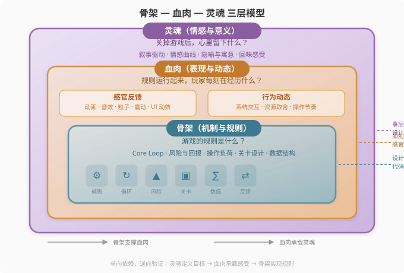

# 第0章：学习游戏设计的元技能

> **本章定位：** 第1章开始，本书会教你"怎么做一款游戏"——七步流程、双螺旋模型、设计文档、Kill Criteria。但在那之前，有一个更重要的问题：**你怎么成为一名游戏设计师？**
>
> 本章不教具体技法。它教你**学习游戏设计的元技能**——三条彼此交织的学习路径，以及一个贯穿全书、也贯穿你所有设计工作的统一分析框架。
>
> 编程之前，你要先学会"如何学习编程"：读文档、跑示例、调试、Google。游戏设计也一样——设计之前，你要先学会"如何学习设计"。

---

## 关于本章的阅读方式

如果你急于动手，**0.2（实践学习）** 可以先看。如果你是"不搞清楚原理就难受"型读者，**从 0.1 开始**。如果你已经有几款自己的作品，想从别人的游戏中汲取养分，**直接跳 0.3**。三条路径不是三种选择——它们是同一套技能的三根支柱。最优秀的独立开发者，无一例外都在同时使用这三种方法。本章最后，我会告诉你如何把它们融入日常。

---

## 0.1 理论学习：地图与工具

> **这一节解决什么问题：** 游戏设计理论到底该不该学？如果学，学什么、怎么学？如何避免"学了一堆理论还是不会做游戏"的困境？

### 为什么理论不是"没用的大道理"

每位游戏设计师都听过这场争论：

> "多看书，不然你连为什么好玩的都说不清。"
> "别浪费时间看书，直接做，做坏十个比看十遍书有用。"

两极都对，但都不够。真相是：**理论是地图，实践是走路。** 没有地图你会迷路；只看地图你永远在原地。

> **程序员类比：** 理论 ≈ 编程语言的语法手册。你不会把整本手册背下来再写代码——但当你遇到报错时，手册能救你的命。

理论的真正角色有三个。

#### 角色一：理论是"语言"

新手做设计往往全凭直觉。你觉得某个操作很"爽"，某种规则很"累"，但说不清为什么。理论给你一套词汇：

| 你的直觉 | 理论给出的词汇 | 价值 |
|---------|-------------|------|
| "这个跳跃感觉很僵硬" | 缺少"输入缓冲"（Input Buffer） | 知道该改什么参数 |
| "玩家玩到一半就不玩了" | "学习曲线过陡" | 知道该调整哪段关卡 |
| "打赢了但没成就感" | "奖励不足以匹配风险" | 知道数值该朝哪个方向改 |
| "玩家不停重复玩" | "核心循环（Core Loop）的正反馈强度足够" | 知道该保留什么 |

有了词汇，你就可以把模糊的感受翻译为可操作的诊断。这在复盘和团队沟通中意味着：**你不会说"多加点感觉"，而是说"把跳跃前的允许输入时间从 3 帧扩展到 6 帧"。**

#### 角色二：理论是"借镜"

游戏是一个庞大而复杂的系统。仅靠个人经验，你不可能穷尽所有可能性。理论是无数开发者的失败与成功的压缩存档——你读一章，等于节省了别人三个月的弯路。

| 理论概念 | 如果不知道，你可能会…… | 知道之后的简洁启示 |
|---------|---------------------|-----------------|
| **心流（Flow）** | 把难度做得越来越难，导致玩家焦虑弃坑 | 难度曲线应该像锯齿——挑战之后给喘息 |
| **操作负荷（Cognitive Load）** | 同时教玩家 5 种操作，结果一样都没记住 | 每次只引入一个新操作，掌握后再叠加下一个 |
| **风险与回报（Risk vs Reward）** | 高难度区域奖励和低难度一样，玩家不打 | 风险越大的选择，回报必须呈非线性增长 |
| **30 秒乐趣原则** | 花三天做了华美开场动画，没人玩到第二关 | 玩家的前 30 秒必须是核心玩法的浓缩 |

理论不会直接告诉你"该怎么做"，但它能减少你无谓的弯路。就像你不会自己去发现"指针需要手动释放内存"——你已经从别人的经验中学会了。

#### 角色三：理论是"批判的起点"

最重要的一点：**理论不是圣经，而是可被质疑的观点。**

真正的学习不是"照着做"，而是"用来思考"。每一条理论都值得你在实践中验证、调整，甚至推翻。当你开始说出"这条理论在我的项目里不适用，因为……"——你已经在从"学生"变成"设计师"了。

> *Rules of Play* 的作者 Salen 和 Zimmerman 在书中说过类似的意思：理论提供的是"批判性框架"（critical framework），不是"答案"。设计是第二序问题——你设计的不是体验本身，而是产生体验的规则系统。理论帮你理解这个系统的运作原理，但它不能替你做出每个具体决策。

---

### 学什么样的理论：骨架—血肉—灵魂三层模型

理论太多。如果全学，你会陷在知识的沼泽里。你需要一个快速定位"这个理论管什么"的导航系统。

本书使用一个三层模型来组织所有设计知识。先看它最核心的区分——三层各自回答什么问题：

| 层 | 本质 | 核心问题 | 设计师做什么 |
|----|------|---------|------------|
| **骨架** | 设计师**直接创造**的东西 | 游戏的规则是什么？ | 写代码、定数值、设计数据结构 |
| **血肉** | 玩家**即刻体验**到的东西 | 规则运行起来，玩家每时每刻在经历什么？ | 设计反馈、编织系统交互、塑造操作手感 |
| **灵魂** | 玩家**事后回味**的东西 | 关掉游戏后，心里留下什么？ | 定义情绪目标、塑造氛围、设计情感弧线 |

三层之间的关系是**单向依赖、逆向验证**：骨架支撑血肉，血肉承载灵魂；但验证时反过来——灵魂定义了目标感受，血肉是感受的载体，骨架是实现血肉的规则。



> **与 MDA 框架的关系：** 如果你熟悉 MDA（Mechanics → Dynamics → Aesthetics），这个三层模型与它有对应关系，但并不等价。骨架对应 Mechanics（规则），灵魂对应 Aesthetics（体验）。**血肉是本书对 MDA 的关键扩展**——它涵盖了 Dynamics（行为与反馈的涌现）**加上** MDA 没有覆盖的感官表现层（动画、音效、粒子、震动）。MDA 在"规则"和"体验"之间只有一层抽象的"动态"，而本书的"血肉"告诉你可以用双手去设计和调整的具体东西：操作手感、反馈节奏、系统交互的张力、视觉信息的密度。在本书后续章节中，当你需要从体验倒推设计时（如第 4 章），这个三层模型会反复出现：从灵魂（目标感受）出发，推导血肉（玩家每一秒该经历什么），再落到骨架（需要什么规则）。

> **程序员类比：** 骨架 ≈ 核心算法与数据结构（决定了程序能做什么）、血肉 ≈ UI 框架 + 交互反馈 + 运行时行为（决定了程序好不好用、用起来顺不顺手）、灵魂 ≈ 产品理念和用户感受（决定了程序是否被记住）。三层缺一不可——算法错乱的程序跑不起来，交互难用的程序没人用，没有理念的程序随时可被替代。

#### 骨架（机制与规则）：让游戏"站住脚"

骨架是游戏最底层的规则——玩家能做什么、如何与系统交互、交互之后会发生什么。这是设计师直接定义的东西：代码、数值、数据结构、状态机。

**核心学习领域：**

| 概念 | 一句话定义 | 典型问题 |
|------|----------|---------|
| **核心循环（Core Loop）** | 玩家每分钟重复数十次的最小行为-回报闭环 | "战斗→奖励→强化→更强的战斗" |
| **风险与回报** | 高风险必须匹配高回报，否则玩家不会冒险 | 远路尽头有宝箱吗？ |
| **操作负荷** | 玩家能同时处理的信息和操作的上限 | 新手期一次引入几个操作？ |
| **关卡设计原则** | 学习曲线、渐进式挑战、引入-发展-转折-高潮 | 关卡为什么在第 3 波敌人后变无聊？ |
| **正反馈与负反馈** | 正反馈让优势扩大（加速结束），负反馈给落后方追赶机会 | 领先方会不会永远赢？ |

学习骨架理论，就像学习搭建建筑的结构力学。没有骨架，游戏站不住。

#### 血肉（表现与动态）：让游戏"活起来"

骨架让你能动，血肉让你觉得"爽"。血肉有**两个来源**：

**1. 感官反馈（视听触）：** 你在屏幕上看到的、听到的、感受到的一切。动画、音效、粒子、震动、UI 动效——每一次操作后即刻涌入感官的信息。

**2. 行为动态（系统交互的涌现）：** 多个子系统碰撞后产生的有趣局面。战斗系统与经济系统的冲突让玩家纠结"买武器还是买药水"；成长系统与关卡系统的摩擦让玩家在"继续深入"和"回去升级"之间做选择。这些纠结和张力不是动画加出来的，而是系统骨架之间的交互产生的——它们同样是血肉，被称为**结构性血肉**（详见第 11 章）。

**核心学习领域：**

| 概念 | 一句话定义 | 典型问题 |
|------|----------|---------|
| **Juiciness（丰富感）** | 通过动画、音效、粒子、震动等让操作产生超比例的感官反馈 | 跳跃不只是位移——角色被拉伸、落地有音效、周边有粒子 |
| **UX（用户体验）** | 信息呈现是否清晰、操作路径是否直观 | 玩家不看教程能开始玩吗？ |
| **学习无障碍** | 通过视觉暗示和巧妙引导，让玩家"看就会" | 发光的物体吸引玩家走过去 |
| **系统编织** | 子系统之间的资源共享和跨系统触发产生行为动态 | 同一货币被战斗、成长、好感度三个系统同时消耗 |

> 为什么《暗黑破坏神》系列让人刷到天亮？感官血肉：每次击杀伴随的爆裂音效、金光散射、装备图标落地的满足感。结构性血肉：装备词条、技能搭配、掉落概率之间的交互产生了"永远有更好的"的行为张力。两种血肉叠加，才是真正的上瘾引擎。

#### 灵魂（情感与意义）：让游戏"被记住"

灵魂是游戏的最高层——玩家在关掉游戏之后，心里还留下什么。

**核心学习领域：**

| 概念 | 一句话定义 | 典型问题 |
|------|----------|---------|
| **叙事驱动 vs 机制叙事** | 故事是由对话推动，还是由玩家的操作自然产生 | 玩家在讲述自己的故事吗？ |
| **情感曲线（Emotional Arc）** | 如何在游戏全过程中安排情绪的起伏 | 紧张之后有释放吗？高潮之后有余韵吗？ |
| **隐喻与寓意** | 通过简单的机制传达复杂的情感或观念 | 《Journey》为什么没有一句话却让人落泪？ |

灵魂不是"加上一段煽情剧情"——它是三层合一后自然浮现的东西。《Flappy Bird》没有剧情，但它让人"愤怒、执着、再试一次"的情绪循环，就是它的灵魂。《Undertale》的"饶恕"选项不是剧情——它是一个机制，而这个机制本身就承载了灵魂。

---

### 如何学习理论：四种方法

光知道学什么理论还不够。学习理论最怕"读过就忘"——这等于没读。以下是四种经过验证的学习方法：

#### 方法一：系统阅读

找 1-2 本经典教材，从头到尾系统性读完（而非碎片化地 Google）。推荐入门：《游戏设计艺术》（The Art of Game Design: A Book of Lenses）或《游戏规则》（Rules of Play）。

**关键：不要追求"记住"，而要追求"产生问题"。**

边读边在空白处写：

- "这条理论我在哪个游戏里见过？"
- "如果我用它做一个原型，能不能验证？"
- "有没有反例？什么情况下它会失效？"

带着问题读，知识才会从纸面迁移到大脑。

#### 方法二：观看与笔记

GDC 讲座、开发者访谈、Game Maker's Toolkit 这类 YouTube 频道——它们比书本更鲜活，因为往往带有一手案例。

观看时别被动接收。做三栏笔记：

| 他们解决了什么问题 | 为什么这个方法在这款游戏里有效 | 如果换到我的项目，会失效吗 |
|------------------|---------------------------|-----------------------|
| | | |

#### 方法三：拆解游戏

这是最重要的一步：**把理论变成分析工具。**拿任意一款游戏，用三层模型拆了它：

- **骨架：** 核心循环是什么？玩家做什么？系统怎么反馈？
- **血肉：** 视听风格是什么？反馈怎么让操作变爽？
- **灵魂：** 玩家玩完后感受到什么？这种感受从哪里来？

> 例：拆《俄罗斯方块》
> - **骨架：** 下落方块 + 旋转移动 + 消行得分。张力来自时间压力（越来越快）与空间约束（越堆越高）的矛盾。
> - **血肉：** 消行的音效（满足感）、Tetris 消除四行的闪光（高潮反馈）、方块色彩区分（信息清晰）。
> - **灵魂：** 不断逼近的焦虑与完美消除的释放。一种"在混乱中寻找秩序"的强迫性满足。

不断拆解不同类型的游戏，理论会从纸面知识变成直觉工具。

#### 方法四：对比与复盘

把同类的两款游戏放在一起比较，最能看出理论在不同语境下的变形。

| 对比维度 | 《Celeste》 | 《超级肉肉哥》 |
|---------|-----------|-------------|
| **骨架（机制）** | 高难度平台跳跃 + 冲刺 | 高难度平台跳跃 + 跑酷 |
| **血肉（表现）** | 像素美术，温柔色调，角色拉伸动画 | 夸张血腥，极端配色，爆裂反馈 |
| **灵魂（情感）** | 关于焦虑与自我接受——死后的快速重生传递了"失败不可怕" | 关于疯狂与恶趣味——死亡的血迹留在墙上，强化"你逃不掉的" |

骨架相似的游戏，为什么体验截然不同？答案在血肉和灵魂的差异里。这种对比让你对每一层的作用有更精准的理解。

---

### 从理论到实践：三座桥梁

学理论最容易卡住的点是——**看完了，但动手时还是大脑空白。** 你需要三座桥梁来连接知识库与编辑器：

#### 桥梁一：用理论设计原型

把理论当作"实验变量"，而非"完工标准"。

> **不要这样做：** "我要做一个符合心流理论的游戏。"（太模糊，无法执行）
> **要这样做：** "我的假设是——给玩家回合之间 2 秒的喘息窗口，能降低焦虑。我做两个版本对比测试：A 版无缝连续、B 版插入 2 秒缓冲。"

每组实验只验证一个理论概念。这是最快的学习方式。

#### 桥梁二：用理论复盘失败

原型不好玩时，不要说"感觉不行"。用理论重新描述问题：

| 不要说 | 试着说 | 这意味着 |
|--------|--------|---------|
| "太无聊了" | 核心循环的正反馈不够密集——玩家每 30 秒才能获得一次明显回报 | 缩短奖励间隔 |
| "太难了" | 学习曲线前三个关卡的斜率太陡——第二个挑战的难度是第一个的 3 倍 | 降低第二关难度或在前三关增加"安全区" |
| "很乱" | 同时引入的操作超过玩家认知负荷——玩家在意愿建立前被信息淹没 | 拆分为 3 个小教程段落 |

这种复盘让你从"迷茫"走向"有方向地重试"。

#### 桥梁三：用理论做创意延展

理论不仅可以诊断问题，还可以激发新创意。

规则："选一条理论 → 用一个极端版本设计一个玩具"

| 理论 | 极端化玩法 | 可能的机制方向 |
|------|----------|--------------|
| 风险与回报 | "每次行动的风险是永久性的——选错了不能回头" | Roguelike 的永久死亡 |
| 正反馈循环 | "每次小胜利都会滚雪球——但雪球也可以崩溃" | 资源管理中的杠杆机制 |
| Juiciness | "让最无聊的操作也变得华丽——比如菜单切换也有全屏动画" | 《女神异闻录 5》的菜单美学 |

---

### 理论学习中的常见误区

| 误区 | 为什么错 | 正确的做法 |
|------|---------|----------|
| **当成教条** | "MDA 框架说了，必须先 Mechanics 再 Dynamics 再 Aesthetics"——不，框架是视角，不是工序 | 把理论当工具，不是当律法 |
| **停留在书本** | 读完 5 本经典教材却还没打开过引擎 | 每读完一章，至少动手做一个 1 小时的小原型 |
| **追求完整体系** | "必须学完所有理论才能开始做游戏"——这是典型的新手拖延症 | 先学一个概念，做一个原型验证它，再学下一个 |
| **盲目套用** | 把《魔兽世界》的经济系统理论直接套在自己的 2 小时小游戏上 | 问：这条理论在我的游戏规模和语境下是否适用？ |
| **只看"怎么做"，不追问"为什么"** | 记住了"跳跃要有缓冲帧"，但不知道这样做的深层原因（人类反应时间有限） | 追问理论背后的心理学、认知科学或设计原理 |

---

## 0.2 实践学习：原型—测试—打磨—新生

> **这一节解决什么问题：** 不看书能学会游戏设计吗？如果可以，实践中到底在"学"什么？如何让每一次动手都变成一次有方向的实验，而不是随机试错？

### 实践是游戏设计不可替代的学习方式

游戏的"好玩"无法被提前算出。它不像编写一个排序算法——你可以分析时间复杂度、读完论文、理解边界条件，然后一次写对。游戏的"好玩"更接近科学实验：**你只能通过"假设→验证→调整"的循环来逐步接近答案。**

> **程序员类比：** 你写了一个多线程模块，自以为逻辑完美，跑起来发现随机 deadlock。这时候你不再是猜——你会加日志、追踪锁顺序、逐步缩小问题范围。游戏设计同理：原型 = 你的"可运行代码"，测试 = 你的"日志输出"，打磨 = 你的"重构优化"，新生 = 你的"推倒重写那个你终于意识到设计有本质缺陷的模块"。

实践学习的内在逻辑可以概括为一个四阶段循环：

```
  原型（提出假设）
      ↓
  测试（收集数据）
      ↓
  打磨（参数优化）
      ↓
  新生（范式转移）
      ↓
  （回到下一个原型）
```

### 阶段一：原型——先做一个"玩具"，别一上来就做"游戏"

最常见的陷阱：新手的第一个项目就是"开放世界 + 复杂剧情 + 在线多人"。三个月后卡在菜单界面。

**原型的正确定义：** 原型不是游戏的简陋版本。它是**一个最小可行性实验（Minimum Viable Experiment, MVE）**——它只验证一个明确的假设。

| 你的假设 | 你需要的原型 | 不需要的东西 |
|---------|------------|------------|
| "受限的空间跳跃能产生紧张感" | 一个方块 + 几个平台 + 跳跃逻辑 | 美术、UI、音乐、剧情、关卡系统 |
| "资源递减 + 风险递增的循环能驱动探索" | 角色 + 采集物 + 递减计数器 | 战斗系统、NPC 对话、成就 |
| "两个相交的物理轨道能产生有趣的意外" | 两个圆形 + 碰撞检测 | 角色设计、世界观、音效 |

> **Kyle Gabler 的"Toy First"原则：** Gabler（《World of Goo》的共同创作者）在 CMU Experimental Gameplay Project 中的核心理念——先做一个没有目标、没有胜负、但拿到手里就忍不住玩的"玩具"。如果连玩具都不好玩，加上目标是没用的。这句话值得背下来：**"好玩的玩具才是游戏的原型；不好玩的玩具加任何规则都救不了。"**

**骨架优先原则：** 原型阶段只做骨架——机制与规则。用灰盒环境（灰色的方块、临时的几何体）排除所有干扰变量。如果你在最简陋的灰盒环境下都感受不到核心乐趣，那么加上美术和音效也不会让它变得好玩。

### 阶段二：测试——让数据说话，不要自我欺骗

原型做好了。现在是最容易被跳过的步骤——把它交给别人。

**给谁试？** 朋友是最不可靠的测试者（他们想让你开心）。找"不认识但有目标受众特征"的人。Jakob Nielsen 的人机交互研究给出过一个数字：**5 个用户能发现 85% 的问题**——但你得找对用户。

**怎么测？三条铁律：**

1. **不说话、不解释、不引导。** 如果玩家需要你解释，说明你的设计没有说话。
2. **观察行为，不依赖口头反馈。** 问"你觉得好玩吗"是最没用的——有用的数据是：第一次操作后玩家皱眉了还是微笑了？放下之后再拿起来了还是直接走了？
3. **关注"再玩一次"的冲动。** 这是最诚实的数据——比任何问卷回答都更准确地反映核心循环是否成立。

**15 秒规则：** 玩家能否在 15 秒内理解玩法？如果能——骨架的复杂度在可接受范围内。如果不能——你需要砍掉前置门槛。

**如果测试结果是负面的怎么办？** 不要上美术、不要加音效、不要写剧情。回到原型，调整骨架。**在骨架成立之前添加血肉，等于在烂地基上装修——迟早要砸掉。**

### 阶段三：打磨——让骨架长出肉、注入灵魂

骨架经受住测试之后，才是打磨阶段。这个阶段分两步走：

**第一步：增添血肉（反馈与表现）**

| 操作 | 灰盒版 | 注入血肉后 |
|------|--------|----------|
| 跳跃 | 方块上移 100px | 拉伸动画 + 落地粒子 + 音效 + 轻微震动 |
| 碰撞 | 双方块停止 | 弹开动画 + 撞击音效 + 血条闪烁 |
| 得分 | 数字 +1 | 数字飞向计分板 + 音高递增的连击音效 |

血肉不是"锦上添花"——它是功能性的。**反馈让玩家的操作产生"重量"和"后果"，这才是交互的核心。** 没有反馈的机制只是数学公式在运行。

**第二步：注入灵魂（情感体验）**

灵魂不是写一段感人剧情。灵魂是玩家在玩的时候被唤起的情感核心。

| 游戏 | 情感核心 | 如何通过机制传达 |
|------|---------|---------------|
| 《粘粘世界》 | 连接与分离 | 你搭建的结构可能倒塌——你会对"球"产生责任感 |
| 《Flappy Bird》 | 愤怒与执着 | 每次死亡即刻重来——愤怒还没来得及消退，你已经在下一局 |
| 《星露谷物语》 | 宁静与归属 | 每天有节奏限制——你不是在"肝"，是在"过日子" |
| 《Undertale》 | 善意与愧疚 | "饶恕"是一个真实机制，不是剧情按钮——你不杀，代价是真的 |

**打磨也必须回到测试。** 你会发现：某段动画虽然炫目，但让操作节奏变慢；某段音乐虽然动听，但打断了玩家的专注。继续改，继续测。

### 阶段四：新生——推翻与重构

新生不是宣告失败。新生是你的设计直觉在提升。

什么时候需要"新生"？

- 连续 3 轮测试后，核心循环仍然无法让玩家产生"再来一次"的冲动
- 打磨过程中发现，机制的深层缺陷无法通过参数调整修复
- 你在测试中观察到一个"错误操作"意外有趣——那条意外的岔路可能比原路更有价值

新生有两个方向：

| 类型 | 做法 | 例子 |
|------|------|------|
| **改良型新生** | 保留核心，更换外围——改变机制参数、替换表现风格、重塑情感方向 | 你的平台跳跃不好玩，但其中"冲刺穿透墙壁"的操作让测试者兴奋——围绕这个做一个新原型 |
| **颠覆型新生** | 只保留在失败过程中获得的设计直觉，完全推翻概念 | 原本做解谜游戏，但在"错误操作"中发现了物理碰撞的趣味——转而做一个物理沙盒 |

**失败的价值：** 每一次推翻都不是浪费时间。**每一次失败，你都在积累"什么东西不成立"的信息——而这正是设计直觉的唯一真正来源。** 理论可以告诉你可能会踩什么坑，但只有摔下去，你才知道那个坑到底有多深。

---

### 实践循环与七步流程的关系

本书后续章节将详细介绍从概念到发布的**七步流程**（宏观流程）。这里先明确它与实践学习循环的关系：

| | 实践四阶段循环 | 七步流程 |
|---|-------------|--------|
| **粒度** | 微观循环（可以在一天内完成一轮） | 宏观流程（跨越数周到数月） |
| **覆盖范围** | 一个机制、一个关卡、一个系统 | 从概念到发布的全生命周期 |
| **关系** | 七步流程的每一步内部，都可能包含多个"原型→测试→打磨→新生"微循环 | |

> 举例：在第 5 步"垂直切片"阶段，你做了一段关卡。你原型了这段关卡的结构（原型），让测试者玩了 10 分钟（测试），调整了敌人配置和光效（打磨），最后发现这段关卡的核心体验不对——推倒重来（新生）。这整个过程就是一个微循环，发生在七步流程的宏观步骤内部。

---

### 从实践到成品的递进路径

每一次"原型→测试→打磨→新生"循环，游戏都在三层上向成品靠近：

```
阶段      骨架状态          血肉状态          灵魂状态
──────────────────────────────────────────────────
原型     "能跑"            不存在            不存在
测试     "有人能玩"         不存在            不存在
打磨     "玩得顺"           "玩得爽"          若隐若现
成品     "闭环完整"         "反馈鲜活"         "难以忘记"
```

> **检验标准：**
> - **骨架稳定：** 机制清晰、核心循环顺畅、至少"能玩"
> - **血肉丰满：** 反馈鲜活、手感愉悦、真正"好玩"
> - **灵魂注入：** 氛围统一、情感集中、成为"难忘体验"

三层不是先后完成的——它们在你每一次循环中同时生长。只不过在早期，骨架占工作量的 80%；到后期，血肉和灵魂逐渐占比更大。

---

### 实践学习的自我检查清单

每次完成一轮实践循环后，自问以下问题：

- [ ] 我的假设是什么？我能否用一句话说清这个原型在验证什么？
- [ ] 我是否用了最简陋的方式搭建原型？有没有不必要的内容？
- [ ] 测试者能否在 15 秒内理解玩法？第一次操作后的自然反应是什么？
- [ ] 测试者是否有"再来一次"的冲动？如果没有——我是否在回避骨架问题，转而在加美术？
- [ ] 打磨时，我加的每一个反馈（音效/动画/粒子）是"放大机制"还是"掩盖机制"？
- [ ] 如果需要推翻，我保留了哪些直觉和经验？我学到了什么"不能做"的东西？

---

## 0.3 分析学习：观察—拆解—模仿—创新

> **这一节解决什么问题：** 别人的游戏我玩得很爽，但怎么把"我觉得好玩"变成"我知道为什么好玩"？如何从别人的设计中偷师，而不是单纯的抄袭？

### 分析为什么是第三条学习路径

游戏设计的本质不是凭空发明。它是**站在前人的肩膀上，进行组合、迭代与微创新。**

看看那些被称为"原创"的独立游戏：《Balatro》= 德州扑克牌型 × Roguelike 升级系统 × 独立游戏美学。《Stardew Valley》= 《牧场物语》的核心循环 + 《暗黑破坏神》的刷装备节奏 + 像素美术 + 一个开发者的执念。《Celeste》= 《超级肉肉哥》的硬核平台跳跃 + 《蔚蓝》自己的故事灵魂。

没有一款游戏是从零创造的。**差别在于：平庸的设计师复制，优秀的设计师分析后再创造。**

> **程序员类比：** 分析别人的游戏 ≈ 阅读优秀的源代码。你不会复制粘贴——你读它的架构、理解它的模式、然后在自己的项目里用类似的思路解决不同的问题。

分析学习的四步法是：**观察 → 拆解 → 模仿 → 创新。**

---

### 第一步：观察——带着研究者的眼睛去玩

不要"沉浸式地享受"——你已经会了。用研究者的心态重新打开一款游戏。

**观察三问：**

1. **"这里发生了什么？"**（描述现象——玩家在做什么？屏幕上显示什么？）
2. **"它为什么让我有这个反应？"**（追溯原因——哪个机制触发了我的紧张？哪个反馈让我觉得满足？）
3. **"这个设计在其他游戏里会怎样？"**（跨语境思考——如果《塞尔达》的耐久度系统放进一个生存游戏，会有什么不同？）

**关键技巧：** 玩游戏时旁边放一个笔记本（或手机备忘录）。每当你产生强烈情绪（愤怒、喜悦、焦虑、满足），立刻暂停，记下：**刚才发生了什么？** 这里就是你最值得分析的时刻。情绪不是数据噪音——它是设计效果的直接信号。

---

### 第二步：拆解——把完整的体验撕成零件

拆解的核心工具是 **"动作—挑战—反馈"三角关系**（Action-Challenge-Feedback Triangle）：

```
       玩家动作（Action）
           ↓
   系统挑战（Challenge）  ←──→  系统反馈（Feedback）
```

任何游戏机制，都可以拆解为这三者的闭环：

| 游戏 | 动作（Action） | 挑战（Challenge） | 反馈（Feedback） |
|------|-------------|-----------------|----------------|
| 《黑暗之魂》战斗 | 攻击、翻滚、防御 | 敌人攻击模式、体力限制、地形 | HP 减少、硬直、敌人死亡掉落 |
| 《Flappy Bird》 | 点击屏幕上升 | 重力下坠、管道间隙 | 穿过得分、撞到死亡动画 + 音效 |
| 《俄罗斯方块》 | 旋转、移动方块 | 时间加速、空间缩小 | 消行得分、游戏结束 |

拆解的目标是把"这个游戏好好玩啊"翻译为"这个闭环的哪一环在起关键作用"。

**额外维度：** 拆解"动作—挑战—反馈"只是骨架层。完整的拆解还需要覆盖：

| 层 | 拆解维度 | 关键问题 |
|----|--------|---------|
| **骨架** | 动作-挑战-反馈三角、核心循环结构、数值参数范围 | 游戏规则是什么？张力从哪里产生？ |
| **血肉** | 视觉风格、音效设计、UI/UX、反馈叠加方式 | 反馈如何放大机制？视听风格与玩法是否匹配？ |
| **灵魂** | 主题、氛围手段、叙事方式、回味感受 | 玩家离开游戏后带着什么情绪？这种情绪是通过什么手段达成的？ |

---

### 第三步：模仿——用灰盒复刻核心机制

理解不等于掌握。你需要动手。

**模仿的正确打开方式：** 不要复刻整款游戏——**只做核心机制的灰盒原型。**

| 要模仿的游戏 | 你只需要做的 |
|------------|------------|
| 《Flappy Bird》 | 一个方块 + 重力 + 点击上升 + 两个上下有间隙的矩形障碍 |
| 《超级肉肉哥》 | 一个方块 + 跑 + 跳 + 墙壁贴附 + 三个平台 |
| 《俄罗斯方块》 | 7 种形状的方块 + 下落 + 旋转 + 消行 |
| 《Baba Is You》 | 一个可移动方块 + "BABA IS YOU" 文本推块规则系统 |

灰盒模仿的价值不在于"做出来"——而在于你会在过程中发现玩家看不见的东西：

- 重力值该设多大才会让跳跃感觉"轻"还是"重"？
- 判定框要不要宽容 1-2 像素来避免"明明跳过了却死了"的沮丧？
- 按键后上升的初速度多大，才能让操作感觉"跟手"？

**这些细节，光靠观察和分析永远无法获得。它们只有在你亲手实现时才浮出水面。**

---

### 第四步：创新——在三角关系中做变形

最关键的一步：不是你复制了什么，而是你**改变了什么**。

回到"动作—挑战—反馈"三角关系。你可以通过变形任意一环来创造新的体验：

| 变形目标 | 原始设计 | 变形方向 | 可能的创新 |
|---------|--------|--------|----------|
| **动作** | 《Flappy Bird》：点击上升 | 改为拖拽控制高度 | 需要更精确的控制，降低随机挫败感 |
| **动作** | 平台跳跃：按键跳 | 改为蓄力跳 | 引入时机决策层，增加策略深度 |
| **挑战** | 固定间隙的管道 | 管道移动或旋转 | 挑战从"选择时机"变为"动态预测" |
| **挑战** | 敌人有固定攻击模式 | 敌人学习并适应玩家的攻击习惯 | 强迫玩家不断变换策略 |
| **反馈** | 得分 +1 | 穿过特定间隙触发音乐节拍 | 把玩法与音乐绑定，产生节奏感 |

> **微创新的本质：** 不是创造一种前所未有的动作——而是在已有骨架上调整一环，观察它如何改变整个体验。这就是为什么分析之后必须动手。你动了重力值，整个跳跃的手感变了。你改变了挑战的出现节奏，玩家的情绪曲线就变了。你加入了音效反馈，疲劳感就降低了。**设计不是画一张蓝图，而是在无数微小的调整中寻找那个"刚好对"的组合。**

---

### 案例：用 Flappy Bird 做完整四步分析

让我们走一遍完整的"观察→拆解→模仿→创新"流程。

#### 观察阶段

打开 Flappy Bird。开始玩。带着笔记本。

| 我做了什么 | 我的感受 | 追问 |
|----------|--------|------|
| 第一次点屏幕，鸟飞起来 | "哦，这么简单" | 为什么只用一个动作就感觉"学会了"？ |
| 撞上第一个管道，死了 | "妈的我明明跳过了" | 判定框是不是偏严格？这是 bug 还是 design？ |
| 第二次立刻重开 | "再来" | 死亡到重开的间隔有多短？ |
| 连续穿过 5 个管道 | "我进步了" | 为什么这种进步感这么强烈？ |
| 又死在第 6 个管道 | "不甘心" | 为什么挫折没有导致弃玩，反而激发了"再来"？ |

#### 拆解阶段

**骨架层（动作—挑战—反馈三角）：**

| 环节 | 要素 | 拆解 |
|------|------|------|
| **动作** | 点击屏幕 | 输入极简（一个动作）、无位置限制（点哪里都一样）、无技能树 |
| **挑战** | 重力 + 管道间隙 | 重力恒定下坠（可预测），管道高度随机（不可预测），两者叠加产生持续张力 |
| **反馈** | 穿过=得分+清脆音效，碰撞=死亡动画+沉重音效 | 正反馈（得分音效）频率：每穿过 1 个管道约 1-2 秒。负反馈（死亡）频率：高，但重开极快（<0.5 秒） |

**骨架分析的关键发现：**

- 死亡到重开的延迟被设计到**极致短**——几乎没有过渡动画、没有结算画面。这不是"省略"，而是故意的：愤怒还没来得及消解，你已经进入下一局。
- 管道高度的随机分布创造了一种**"可控的不可预测性"**——你知道有间隙，但不知道间隙在哪。这比完全随机更有趣，因为你会产生"差点就过了"的懊悔——这是《Flappy Bird》成瘾的核心机制。

**血肉层：**

| 维度 | 描述 | 作用 |
|------|------|------|
| **视觉** | 极简像素：绿色管道、蓝色天空、黄色小鸟。角色眨眼动画 | 没有任何视觉噪音——所有信息在 0.1 秒内被大脑吸收 |
| **音效** | 穿过管道：清脆"叮"。碰撞：沉重"嘭"。得分：短促上扬音 | 每个操作都有**即时**听觉反馈——三重音效让每一帧都有"后果感" |
| **Juiciness** | 小鸟轻微的上下浮动、死亡时鸟翻白眼、管道和地面有简单纹理 | 最小的 Juiciness 投入，最大的情感放大——简约不简陋 |

**灵魂层：**

| 维度 | 分析 |
|------|------|
| **主题（核心情绪）** | 愤怒、执着、不甘——以及最终"我过了"的极度满足 |
| **氛围手段** | 极简的视觉 + 平淡的背景音乐，把所有注意力压缩到**那个点**：管道的间隙 |
| **叙事方式** | 没有叙事。但每个玩家都创造了相同的叙事：**"我差点就过了。"** |
| **回味感受** | 关掉游戏后，那条管道间隙的视觉残留还在你眼前——你还会再打开 |

**三层合一的协调性检查：**

《Flappy Bird》的三层是高度内聚的：
- 骨架的极简（一次点击）→ 血肉的极简（像素美术）→ 灵魂的极纯（一种情绪）
- 如果骨架上加了"技能升级"系统 → 破坏极简 → 血肉需要更多 UI → 灵魂从"纯愤怒"变为"算计"，体验崩塌
- 这就是为什么它的山寨品加了"皮肤""升级""道具"之后反而不好玩——它们破坏了三层的统一性

#### 模仿阶段

灰盒原型只需要：

```
1 个矩形（鸟）+ 重力变量（gravity = -9.8）+ 按空格上升（velocity += 15）
2 个窄矩形（上下管道）+ 固定水平速度向左移动
检测碰撞 = 死亡 → 0.1 秒后重置
穿过间隙 = 得分 + 播放"叮"音效
```

在模仿中你会发现的关键问题：
- 重力的具体数值（-9.8 还是 -12？）决定鸟的"重量感"
- 管道移动速度（3 px/frame 还是 5？）决定操作窗口
- 管道间隙多大才"难但不绝望"？
- 碰撞检测边界要不要缩小 2px 来制造"宽容感"？

#### 创新阶段

基于拆解得到的三角关系，做至少三种变形：

| 变形 | 方向 | 新原型 |
|------|------|--------|
| **动作变形** | 点击变拖拽——手指上下滑动控制鸟的高度 | "控制感"更高，但物理感降低。适合做成"潜行躲避"主题 |
| **挑战变形** | 管道不再固定——随机左右摆动 | 从"时机判断"变为"动态预测"，体验完全不同 |
| **反馈变形** | 穿过管道时不加分，而是触发一段音乐的节拍 | 把 Flappy Bird 变成节奏游戏——穿过管道 = 击中节拍 |
| **灵魂变形** | 背景从蓝天变为灰暗洞穴，音效从清脆变为沉闷 | 同样的机制，不同的情感——从"愤怒执着"变为"压抑坚持" |

> 从一款三年前就被玩烂的小游戏中，你能生出 4 个以上的新原型。这就是分析学习的力量：**不是复制答案，而是理解公式，然后代入你自己的变量。**

---

### 从分析到设计的完整循环

每次分析一款游戏后，你积攒的不是"XX 游戏的机制笔记"，而是**可复用的设计素材库**：

| 分析输出 | 存入素材库 | 未来调用 |
|---------|----------|---------|
| 一种有趣的动作-挑战-反馈组合 | 机制原型库 | "我需要一种简化操作但保留张力的方案 → 参考 Flappy Bird 的单键模式" |
| 一套成功的 Juiciness 叠加方案 | 表现手法库 | "我的核心循环反馈不够即时 → 参考《暗黑》的音效+粒子叠加" |
| 一种有效的情感传达手段 | 情感工具箱 | "我想传达孤独感 → 参考《Journey》的色调+空间尺度" |

**五步法：从分析到设计**

| 步骤 | 做什么 | 输出 |
|------|--------|------|
| **1. 感受与捕捉** | 带着"这一节解决什么问题"去玩游戏。记录强烈情绪及其触发点 | 情绪日志 |
| **2. 结构化理解** | 用三层模型 + 动作-挑战-反馈三角拆解为最小单元 | 拆解表格 |
| **3. 动手验证** | 做一个灰盒原型复现核心机制。观察哪些参数是关键的 | 灰盒原型 + 参数笔记 |
| **4. 创造与微创新** | 变形三角关系中的一环——改变动作/挑战/反馈 | 新原型 |
| **5. 入库与迭代** | 把成功的新原型存入素材库。下一次项目时直接调用 | 素材库条目 |

---

### 分析学习工作表

每次分析一款游戏时，用此表记录：

```
【游戏名称】：
【游戏类型】：
【游玩时长】（用于分析）：

━━━ 骨架层 ━━━
【核心循环描述】（一句话）：
【动作（Action）】：
【挑战（Challenge）】：
【反馈（Feedback）】：
【三角关系中，哪一环贡献最大？】：
【数值参数猜想】（重力/速度/判定框/奖励倍率）：

━━━ 血肉层 ━━━
【视觉风格关键词】：
【最关键的反馈元素】（音效/动画/粒子/震动——选一个）：
【UI 是否"看不见"？（好 UI 是不被注意的）】：
【血肉是否在"放大"骨架，还是在"掩盖"骨架？】：

━━━ 灵魂层 ━━━
【核心情绪】：
【氛围手段】（美术/音乐/节奏）：
【叙事方式】（对话/环境/机制/无叙事）：
【离开游戏后的余味】：
【三层是否一致？有无脱节感？】：

━━━ 创意激发 ━━━
【如果改变动作，会怎样？】：
【如果改变挑战，会怎样？】：
【如果改变反馈，会怎样？】：
【如果只换表现风格（血肉），同样机制能变成什么体验？】：
```

---

## 本章小结：如何将三条路径融入你的设计日常

三条学习路径不是交替进行的——它们应该并行推进。以下是一个可操作的日常建议：

### 每周节奏

| 星期 | 重点路径 | 具体动作 |
|------|---------|---------|
| **周一** | **理论学习** | 集中阅读 1 小时 + 用三层模型拆解本周阅读内容与你的项目的关联 |
| **周二至周四** | **实践学习** | 每天的实践时间合并为一次 1-2 小时的集中动手。周二做原型、周三测试/收集反馈、周四打磨/调整 |
| **周五** | **分析学习** | 选一款完整游戏（或游戏的 30 分钟片段），用 0.3 节的工作表做全量分析。存入素材库 |
| **周末** | **整合** | 回顾本周三项路径的输出：理论笔记 + 原型迭代 + 分析工作表。写一句话总结："这周我在设计上学到了什么？" |

### 长期节奏

| 节点 | 检查项 |
|------|--------|
| **每月** | 回顾素材库——我积攒了多少机制原型、表现手法和情感工具？本月失败的实验教会了我什么？ |
| **每季度** | 做一次"全游戏分析"——选一款 5-10 小时的中型独立游戏，用三层模型完成从第一章到通关的全程拆解 |
| **每半年** | 自问：我现在的设计直觉和半年前相比，区别在哪里？我能在多大比例的设计直觉上给出"理论依据"？ |

---

### 三条路径的内在联系

理论学习给你 **"语言"**——你知道怎么描述问题。
实践学习给你 **"直觉"**——你知道什么东西可能行，什么东西大概率不行。
分析学习给你 **"视野"**——你知道别人是怎么做的，为什么那么做。

> **编程类比（终极版）：**
> - 理论学习 = 读语言规范、设计模式、系统设计论文
> - 实践学习 = 写代码、调试、重构、上线
> - 分析学习 = 读优秀开源项目的源码，理解它们为什么这样架构
>
> 你不会只选其中一种来学编程。你也不会只选一种来学游戏设计。

---

### 本书接下来的阅读路线

第 0 章到此结束。你已经掌握了学习游戏设计的元技能，接下来：

- **第 1 章** 将建立游戏设计的科学基础——什么是"游戏"、为什么设计可以像工程一样被系统化
- **第 2 章** 介绍本书的核心工作模型：**双螺旋模型**——设计线与原型线如何互相缠绕、螺旋上升
- **第 3-9 章** 展开完整的七步流程——从概念孵化到迭代打磨的每一步

在后续所有章节中，你都会看到本章建立的三个核心框架反复出现：

1. **骨架—血肉—灵魂三层模型**——它在每章末尾用于检查该阶段设计的完整性
2. **动作—挑战—反馈三角关系**——它在机制分析中反复出现
3. **原型→测试→打磨→新生循环**——它作为微观循环贯穿七步流程的每一步

**你现在就可以开始。** 翻到下一页之前，先做一件事：打开一首你最近玩的游戏，用本章的"分析学习工作表"走一遍观察和拆解。这一章是让你读的——但真正让你学会的，是那一行行填下去的表格。

---
