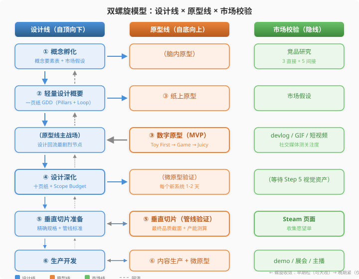
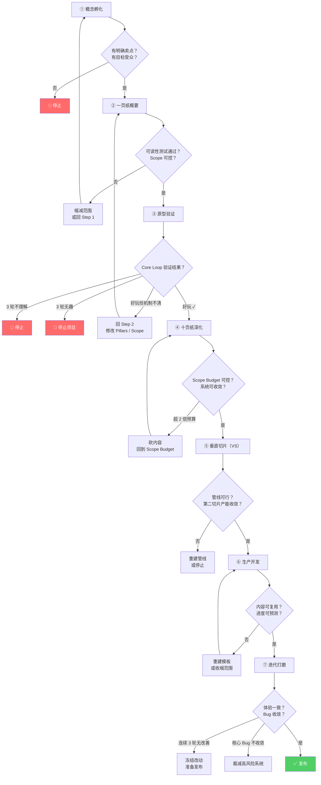

# 第2章：双螺旋模型——设计线与原型线

> **本章在全书中的位置：** 第1章建立了游戏设计的科学观和操作性定义，本章将这一理念转化为具体的工作模型——双螺旋模型。这是全书最核心的"操作系统"，后续第3-9章的七步流程详解，本质上就是这个模型在每一步的具体展开。

---

## 本章解决什么问题

游戏设计的最大悖论是：**设计必须在实现中检验，但实现需要设计来指引方向。** 这个悖论如果处理不好，就会导致两种经典失败——要么"想得太久、从不动手"（设计过度），要么"做得太多、方向全无"（无设计开发）。双螺旋模型将"设计"和"验证"组织为两条互相缠绕、螺旋上升的并行工作线，让这个悖论从"障碍"变成"推进力"。

对程序员读者来说，最直接的类比是：**双螺旋 ≈ 测试驱动开发（TDD）**。设计线 = 写测试用例（提出假设），原型线 = 写实现代码（验证假设），Kill Criteria = 测试失败条件（推翻假设重来）。

---

## 2.1 为什么线性流程对游戏设计无效

> **这一节解决什么问题：** 为什么软件工程中最成熟的瀑布模型，在游戏设计中反而会成为导致项目失败的陷阱？

### 瀑布模型的假设

在传统软件工程中，瀑布模型（Waterfall Model）是经典的线性开发流程：

```
需求分析 → 系统设计 → 编码实现 → 测试验证 → 部署维护
```

它的核心假设是：**需求可以在开发开始前被完整、准确地定义。** 如果你要做一个支付系统，你可以先写清楚"支持的支付方式、结算周期、错误处理逻辑"，然后照着实现。这个假设对支付系统成立，对银行系统成立，对大多数企业软件成立。

但游戏不是企业软件。

### 玩法无法被"提前描述"

游戏设计的核心产出不是"功能"，而是"体验"。你可以描述"玩家按下A键跳跃，最高跳3米，空中可以二段跳"，但你无法在纸上说清楚**这个跳跃好不好玩**。

Katie Salen 和 Eric Zimmerman 在 *Rules of Play* 中提出了一个根本性的原则：**你无法在运行游戏之前完全预测游玩体验。** 他们明确指出，游戏设计师不直接创造体验——你创造的是规则系统，体验是从规则与玩家交互中**涌现**出来的。这意味着无论你的设计文档写得多么详尽，真正的答案只能在玩家与系统的交互中产生。

这就是为什么 *Rules of Play* 将**迭代设计（Iterative Design）**确立为游戏设计唯一可靠的方法论：Prototype → Playtest → Evaluate → Refine → Repeat。他们还提出了一个著名的"20% 规则"：在项目进度的 20% 时，你应该已经玩到了可玩原型。如果你用了 3 个月的总工期，那么第 2 周末就应该有东西能跑。

### 线性流程的两种死法

当独立开发者试图把瀑布模型套用到游戏设计上，通常会掉入两个坑之一：

**死法一：设计过度（Design-First Paralysis）**

```
第1个月：写概念文档，很好
第2个月：写详细GDD，50页
第3个月：还在补充细节，100页
第6个月：GDD写到300页了，游戏一行代码没写
结果：要么永远做不完设计，要么终于开始写代码时发现所有设计假设都是空中楼阁
```

这是一种防御性行为——因为害怕失败，所以用"还在设计"来推迟面对真正的挑战。但游戏设计的问题是：**你设计得越详细、越晚动手，你设计中的错误假设就积累得越多。** 300 页 GDD 在第一行代码运行的那一刻就可能被推翻一半——而且你不知道是哪一半。

**死法二：无设计开发（Code-First Chaos）**

```
第1周：写了一个很酷的移动系统
第2周：加了战斗，感觉不太对
第3周：重做了战斗，加了技能树
第8周：系统堆了一堆，但不知道这个游戏到底是什么
第12周：团队分歧越来越大，项目停摆
```

这是另一种极端——因为等不及，所以跳过设计直接写代码。问题在于，**没有设计方向，每次迭代都是在迷宫中随机选路**。你可能花了三个月做了很多系统，但它们拼在一起没有形成完整的游戏体验。

### 悖论的根因：设计与验证的鸡与蛋

回到本节开头提出的悖论：

- **设计需要验证：** 你设计了一个"侵略性战斗系统"，假设"近战处决回血会让玩家越打越爽"。但这个假设对不对，只有玩家玩过才知道。
- **验证需要设计：** 如果你每做一个原型就凭感觉改，没有设计方向，你将永远在"试来试去"中消耗时间。

这是典型的"先有鸡还是先有蛋"问题，而**瀑布模型的答案——"先把鸡精确地画出来再孵蛋"——在这个问题上是错的。**

### 为什么 TDD 的思路对游戏设计成立

如果你是一个程序员，你可能已经注意到：**这跟软件开发中瀑布模型遇到的问题一模一样。** 在软件工程中，瀑布模型同样面临"需求在开发前就能精确描述"这一不可靠假设。TDD（测试驱动开发）正是为解决这个问题而生的：

1. 先写测试用例（提出对代码行为的假设）
2. 写最少的代码让测试通过（实现假设）
3. 观察测试结果（验证假设）
4. 红色→绿色→重构（迭代优化）

游戏设计的双螺旋模型遵循完全相同的逻辑：

| TDD 概念 | 双螺旋对应 |
|----------|-----------|
| 写测试用例 | **设计线**：写出"我假设玩家会感受到 X" |
| 写实现代码 | **原型线**：做出能测试这个假设的最简版本 |
| 运行测试 | **Playtest**：找目标玩家玩，观察反应 |
| 测试失败（红色） | **Kill Criteria 触发**：假设不成立，回到设计 |
| 测试通过（绿色） | **进入下一步**：假设验证成立，继续深化 |
| 重构 | **设计回流**：根据测试结果修正设计 |

换句话说，游戏设计不是"先画完图纸再施工"的建筑学，而是"先提出假设再实验验证"的**实验科学**。这就是为什么我们需要双螺旋模型——一种能容纳"试错"和"回流"的工作方式，而不是假装这些不会发生。

### 一个对比案例

想象两个独立开发者，面对同一个创意："做一个关于穿越沙漠的生存游戏"。

**开发者 A（瀑布派）：**

```
月 1-2: 写设计文档。定义 15 种资源（水、食物、体力、温度、骆驼体力……）
月 3-4: 设计技能树和制作系统，70 页 GDD
月 5: 开始写代码。实现完整的资源管理系统
月 6: 实现制作系统，UI 很漂亮
月 7: 终于能玩了。发现一个问题：管理 15 种资源不有趣，而是繁琐。
月 8: 试图简化。但发现所有系统都建立在"15 种资源"的假设上——
       砍任何一个都会导致相关的制作配方、UI、技能树全部需要重做。
月 9: 项目废弃。
```

**开发者 B（双螺旋派）：**

```
第 1 周: 写一页纸。Pillar："资源紧缺感让每一步都像赌博"
          Scope：明确不做——骆驼养成、多角色、天气系统
第 2 周: 纸上原型。用骰子和索引卡模拟——发现从 3 种资源开始玩已经很有趣
第 3-4 周: 数字原型。只有 3 种资源，灰盒地形，但核心循环完整
          找 5 个人测试。反馈："很紧张，有点像赌博，好玩"
          也有人反馈："总觉得少点什么"
第 5 周: 回顾设计。发现"少点什么"是缺乏"意外事件"——不是更多资源类型
         加了一个"沙漠风暴随机事件"系统，回 Step 2 更新一页纸
```

开发者的 B 的故事不是虚构的理想化场景——这正是绝大多数成功独立游戏的实际开发路径。游戏的核心不是被"设计"出来的，而是被"发现"的。设计文档是对发现的记录，而不是对创造的规定。**你不会在挖到宝藏之前就写好宝藏的精确描述；你挖上一铲子，看看下面是什么，再决定下一铲子往哪儿挖。**

这就是双螺旋模型的基本立场：**停止假装你可以预测发现——建立一个能容纳发现的系统。**

---

## 2.2 双螺旋的核心机制

> **这一节解决什么问题：** 如何将"设计"和"验证"组织成一个可操作的并行工作模型？两条线各自做什么、如何交互？

### 设计线：自顶向下推导

**设计线是"假设生成器"。** 它从最抽象的概念出发，逐步推导为可执行的具体规格。就像 TDD 中先写测试用例：你在还没写代码的时候，就已经定义了"什么算成功"。

设计线的推导方向是**从宏观到微观**：

```
概念孵化 ──→ 设计支柱 ──→ 核心循环 ──→ 系统设计 ──→ 详细规格 ──→ 内容规划 ──→ 数值参数
  (Why)        (What)      (How 循环)   (How 系统)    (How 具体)   (How 量产)   (How 精确)
```

**类比：** 这就像编程中的类型定义和接口设计。你从"这个模块做什么"（接口）开始，逐步到"每个函数怎么实现"（具体代码）。但关键区别是：编程中的接口定义后实现可以独立进行，游戏设计中接口的"正确性"必须由原型来验证——你定义的"侵略性战斗"接口是对的，还是一个无法让玩家感受到的错误抽象？

设计线的核心交付物随着步骤递进：

| 步骤 | 设计线产出 | 类比 |
|------|----------|------|
| Step 1 | 概念要素表 + 市场假设 | 项目愿景文档 |
| Step 2 | 一页纸 GDD（Pillars + Core Loop + Scope） | 技术规格书的概要 |
| Step 4 | 十页纸设计文档 + Scope Budget | 详细技术设计 |
| Step 5 | 垂切设计规格 + 管线标准 | 生产就绪的接口定义 |
| Step 6 | 完整 GDD + TDD + Asset List | 完整的技术文档 |
| Step 7 | 数值表 + 打磨清单 | 性能优化与 Bug 修复计划 |

### 原型线：自底向上生长

**原型线是"假设验证器"。** 它从最核心、最基础的单体交互开始，逐步叠加系统、填充内容，最终生长为完整产品。

原型线的生长方向是**从核心到外围、从单体到系统**：

```
脑内推演 ──→ 纸上原型 ──→ 数字原型(Toy) ──→ MVP(闭合循环) ──→ 垂直切片 ──→ 完整内容 ──→ 打磨成品
 (想象)      (纸笔验证)    (核心交互)       (可玩版本)        (品质样本)    (全量生产)    (可发布)
```

**类比：** 这就像编程中写实现代码。你从"最简单的能跑的版本"开始（最小可行代码），逐步加功能、加边界处理、加性能优化。但关键区别是：编程中的实现是朝着一个已知正确的接口努力，游戏原型实现的过程中**接口本身可能被证明是错的**——这就是为什么需要回流。

原型线的一个重要概念是 **Toy First（先做玩具）**，来自 Kyle Gabler 在 CMU Experimental Gameplay Project 中的核心经验：在加规则和目标之前，先验证核心交互本身是否有趣。如果无目标时玩家玩它 10 分钟都不觉得枯燥，这个"玩具"就有潜力成为一个好游戏的内核。World of Goo 的粘软泥在没有任何目标、任何规则的情况下就已经让人觉得"好玩想捏"——这就是 Toy First 的力量。

原型线的另一个关键原则是 **Fake It（战略性造假）**：用最快的方法实现效果，不在非核心验证目标上浪费工程时间。光照用烘焙不用实时光追，AI 用假数据不用模式识别，UI 用占位符不用精心设计。**玩家看不到伟大工程——也不在乎。** 但注意："Fake"的是支撑系统（光照、AI、UI），不是你要验证的核心假设本身。如果你的核心是程序化生成关卡，那 procgen 算法就是你正在验证的东西，不能用手工地图书架来"Fake"。

### 双向流动：两条线的交互

单独看，设计线和原型线各自是清晰的独立过程。但双螺旋模型的核心洞察是：**两条线不是独立的——它们之间存在着持续的双向信息流动。**

```
 设计线 ────指引原型做什么────→ 原型线
    ↑                           │
    │                           │
    └────测试结果修正设计假设──────┘
```

**设计 → 原型（正向指引）：** 设计线告诉原型线"当前要验证什么假设"。比如 Step 2 完成后，设计线产出了 Pillar"侵略性战斗让玩家越打越爽"和 Core Loop"近战 → 处决 → 回血 → 继续战斗"。原型线在 Step 3 的任务就是：做出一个能运行这个 Core Loop 的最小原型，让玩家测试。

**原型 → 设计（反向修正）：** 原型线的测试结果回流到设计线，修正假设。如果 5 个测试玩家中 4 个都在退缩而非进攻，那你的 Pillar"侵略性战斗"可能从根本上就错了——不是数值问题，是概念问题。这时你需要回到 Step 1 或 Step 2，重新定义你的设计假设。

### 完整的双螺旋图谱



几点关键观察：

1. **步骤编号不在两条线之间一一对应。** 设计线的 Step 1 和 Step 2 之间没有独立的原型线步骤——原型线在 Step 1 是"脑内原型"（想象前 30 秒），在 Step 2 和 Step 3 之间是"纸上原型 → 数字原型"的连续流。双螺旋不是"设计一步、原型一步"的交替，而是两条线各自有自己节奏的并行推进。

2. **Step 3 是原型线的主场。** 这是原型线从纸上到数字、从 Toy 到 MVP 的集中爆发期。同时，Step 3 的测试结果也是设计线回流最剧烈的节点——原型数据可能推翻所有前面的假设。

3. **Step 4 是设计线的主场。** Core Loop 验证通过后，设计线需要从"方向探索"切换到"执行规划"。十页纸和 Scope Budget 是这个节点的核心产出。注意，在 Step 4 中，原型线也在工作——每个新系统需要做 1-2 天的微原型验证。

4. **Step 5 是双线第一次"拧紧"的节点。** 垂切同时要求设计线给出精确规格、原型线产出最终品质。垂切的测试结果（产能数据、管线可复用性）直接决定能否进入生产。这是整个流程中风险最高的转折点。

### 为什么是"螺旋"而不是"平行线"

如果你观察上面的图谱，会发现一个关键特征：从 Step 1 到 Step 7，设计线和原型线之间的距离在不断缩小。

- Step 1 时，设计是"做一个关于侵略性战斗的游戏"，原型只是"脑内想象"。两条线之间极度松散。
- Step 5 时，设计是"这一关有 3 种敌人类型，Boss 有 2 个阶段"，原型是"这些敌人在最终光照和音效下实际运行"。两条线紧贴。
- Step 7 时，设计是"处决回血从 15% 调到 12%"，原型是"调完后玩家通关率从 42% 变到 51%"。两条线几乎重叠。

这就是**螺旋结构**：不是两条保持等距的平行线，而是一条从松散到紧密的收敛曲线。早期螺旋松——允许大范围探索和剧烈回流（回 Step 1 只损失几天）。晚期螺旋紧——只允许微调（回 Step 4 损失数月）。你可以把它想象成一根弹簧从顶部宽松的圈到底部紧密的圈。

**这个结构回答了一个关键问题：为什么 Kill Criteria 在早期更激进（"3 轮不好玩就停止项目"），在晚期更务实（"连续 3 轮无提升就准备发布"）？** 因为早期停止的成本低，晚期停止的成本高。螺旋的收敛性正是 Kill Criteria 体系背后的物理逻辑。

---

## 2.3 七步流程总览

> **这一节解决什么问题：** 七步分别做什么？如何判断该前进、回头还是停止？Kill Criteria 体系的全局逻辑是什么？

### 七步速查卡

以下速查卡汇总了七步流程的输入、输出、核心问题和 Kill Criteria 关键词。这是本章最核心的一张表——当你迷失在某个步骤中时，回到这张表问自己：我在哪一步？这一步要回答什么问题？触发 Kill Criteria 了吗？

| 步骤 | 输入 | 输出 | 核心问题 | Kill Criteria 关键词 |
|------|------|------|----------|-------------------|
| ① 概念孵化 | 模糊想法 | 概念要素表 + 市场假设 | 有人想玩吗？ | 无卖点/无受众/竞品碾压 → 停止 |
| ② 轻量设计概要 | Elevator Pitch | 一页纸 GDD | Core Loop 是什么？不做什么？ | 可读性失败/Scope 失控 → 回 Step 1 |
| ③ 原型验证 | 一页纸 GDD | 可玩原型（MVP） | Core Loop 好玩吗？ | 3 轮不理解/3 轮无趣/市场无反馈 → 停止 |
| ④ 设计深化 | 验证后的 Core Loop | 十页纸 + Scope Budget | 怎么做完？成本可控吗？ | 预算超 2 倍/系统不收敛 → 砍 |
| ⑤ 垂直切片 | 十页纸 | 品质样本 + 产能数据 | 管线可行吗？真实速度？ | VS 超 2 倍预算/速度不收敛 → 停止 |
| ⑥ 生产开发 | VS + 十页纸 | 内容完成 + 生产模板 | 内容可复用？进度可预测？ | 设计未冻结/速度不收敛 → 重建 |
| ⑦ 迭代打磨 | 完整游戏 | 可发布版本 | 体验一致吗？ | 连续无改善/核心 Bug 不收敛/留存低 → 冻结 |

### 七步一句话

在深入看流程图之前，先把七步的核心问题压缩成最简形式。当你迷失在细节中时，这一句话可以帮你快速定位自己：

| 步骤 | 一句话核心问题 | 你此刻最该做的事 |
|------|-------------|---------------|
| ① 概念孵化 | "有人想玩吗？" | 写市场假设，玩竞品，不要写代码 |
| ② 一页纸概要 | "这个游戏到底是什么？不做什么？" | 强迫自己用一页纸说清楚，找人读 |
| ③ 原型验证 | "核心循环好玩吗？" | 做最简陋的原型，找不认识的人玩 |
| ④ 设计深化 | "怎么做完？要花多久？" | 列 Scope Budget，算总工期 |
| ⑤ 垂直切片 | "能以最终品质做出来吗？" | 做一个完整截面到最终品质，测产能 |
| ⑥ 生产开发 | "能批量生产吗？" | 冻结设计，建模板，持续产出内容 |
| ⑦ 迭代打磨 | "体验一致吗？" | 大规模 playtest，修 Bug，调数值 |

注意：七步中有一个隐式的**情绪节奏**。Step 1-2 是"天马行空期"——可以随意探索、推翻、重来。Step 3-4 是"真相时刻"——你的创意第一次面对现实，情绪波动最大。Step 5 是"压力峰值"——如果能迈过去，后面的路就是体力活而非智力挑战。Step 6-7 是"马拉松"——不再有剧烈的方向变化，但需要持续的心理耐力。理解这个情绪曲线，你就能提前为最难熬的阶段做心理准备。

### 全局决策流程图

下面这张图将所有 Kill Criteria 的跳转路径集中在一张图里。**红色节点 = 停止/废弃，绿色节点 = 发布成功，蓝色的回流箭头 = 设计修正路径。** 从这个视角看，双螺旋模型本质上是一台"带 Kill Switch（紧急停止开关）的状态机"。



### 前进、回流与停止：三种状态转换

双螺旋模型定义了三种基本的状态转换，覆盖了项目进程中的所有可能性：

**1. 前进（Advance）：条件满足 → 进入下一步**

每一步都有明确的"门控标准"（Gate）。你不因为是"时间到了"而前进，而是因为"回答了这个步骤的核心问题"：

- Step 1 → 2：你找到了明确卖点和目标受众
- Step 2 → 3：一页纸的可读性测试通过，Scope 可控
- Step 3 → 4：Core Loop 在外部玩家测试中好玩且行为符合预期
- Step 4 → 5：Scope Budget 可控，系统可收敛
- Step 5 → 6：管线可行，第二切片产能收敛（即真实产能可预测）
- Step 6 → 7：内容可复用，设计已冻结
- Step 7 → 发布：体验一致，核心 Bug 收敛

**类比：** 这就像 CI/CD 流水线中的 Gate。代码不通过单元测试，就不能进入部署阶段。双螺旋模型把同样的纪律带到了游戏设计中——**设计决策不通过验证测试，就不能进入生产阶段。**

**2. 回流（Backflow）：验证失败 → 回到前面的步骤**

回流不是失败——它是双螺旋模型**预设的、正常的**工作模式。就像 TDD 中测试失败（红色）是正常的，你要做的是修改代码或修改测试，而不是沮丧。

回流的三种常见路径：

- **Step 3 → Step 2：** Core Loop 可行但机制不清晰，需要修改 Pillars 或 Scope。例如玩家觉得战斗还行，但搞不清楚"侵略性"到底是什么感觉。
- **Step 3 → Step 1：** Core Loop 根本不好玩，核心假设被推翻。例如所有测试玩家都回避战斗，说明"侵略性战斗"这个方向本身就是错的。
- **Step 5 → Step 3：** 垂切漂亮但不好玩，说明视觉掩盖了玩法问题。需要回去重做原型。

**3. 停止（Kill）：Kill Criteria 触发 → 终止项目或大规模重组**

这是双螺旋模型最硬核的部分。停止不是"放弃"，而是"止损"。

### Kill Criteria 体系的总逻辑

传统游戏设计文献充斥着"你应该这样做""你应该那样做"的建议，但几乎没有人告诉你"什么时候应该停下来"。这正是 Kill Criteria 要填补的空白。

Kill Criteria 的核心设计哲学有三条：

**第一，独立开发者最大的敌人不是缺乏创意，而是沉没成本陷阱。**

你投入的时间、精力、情感会成为你继续走下去的理由——即使所有客观信号都在告诉你"这条路走不通"。用程序员的话说：你已经在调试一个函数三小时了，虽然所有的断点数据都在说"这个算法从根本上错了"，但你舍不得那三小时，于是又调了三小时。

独立游戏领域的沉没成本陷阱尤其凶险，因为：
- **没有外部止损者。** 在公司里，你的 manager 或 producer 会在项目失去希望时叫停。独立开发者没有人会替你按 Kill Switch——必须你自己按。
- **认同感与项目绑定。** "这是我的游戏，否定它就是否定我。" 这种情感绑定让你用"坚持"掩饰"不敢面对失败"。
- **幸存者偏差误导。** 你听说过"坚持了五年终于成功的那个神作"，但你没有听说过"坚持了五年然后默默消失的那一千个"。媒体只报道前者，让你误以为"坚持 = 成功"。

Kill Criteria 用客观条件（"连续 3 轮玩家无法理解核心玩法"）替代主观感觉（"我觉得再改改就好了"），让你在情绪卷入之前做决定。就像自动化测试不会因为"我觉得这个函数看起来差不多对了"而变绿——不过就是不过，数据说了算。

**第二，"什么时候停"比"应该做什么"更重要。**

因为你知道"该做什么"——做原型、写文档、找玩家测试、打磨——这些都不是秘密，网上一搜就有。真正区分成功者和半途而废者的，是**在错误的项目上浪费了多久**。成功的独立开发者不是不犯错，而是犯错后用 Kill Criteria 快速发现、快速停止、快速换方向。

**第三，Kill Criteria 的严厉程度与成本成正比。**

回头看本章 2.2 节的螺旋收敛图：

- Step 1-3 的 Kill Criteria 最激进："找不到卖点就停止""3 轮无趣就停止项目"。因为此时你的投入只有几周到 2 个月。
- Step 4-5 的 Kill Criteria 转向"砍内容""重建管线"——不是停止项目，而是约束范围。因为此时你已经验证了 Core Loop 好玩。
- Step 6-7 的 Kill Criteria 进一步软化："冻结改动""设定硬性发布日期"。此时你的投入已经是数月到数年，目标是"交付"而非"完美"。

这个渐进松弛的 Kill Criteria 体系，就是螺旋收敛结构在决策层面的映射。

**时间预算的硬性约束：**

Kill Criteria 不仅包含"质量条件"（玩家是否觉得好玩），也包含**硬性的时间约束**。这些数字不是拍脑袋的——它们来自独立游戏社区的实际经验总结：

| 阶段 | 推荐时长 | 上限（触发 Kill Criteria） |
|------|---------|--------------------------|
| Step 1 概念孵化 | 1-2 周 | 4 周 |
| Step 2 一页纸概要 | 2-3 天 | 2 周 |
| Step 3 原型验证 | 30 天 | 60 天 |
| Step 4 十页纸深化 | 2-4 周 | 8 周 |
| Step 5 垂直切片 | 4-8 周 | 16 周 |
| **Step 1-3 合计（→ MVP）** | **~2 月** | **3 月** |

关键是"上限"这一列。如果你的 Step 3 原型已经做了两个月还没得出明确结论——**这不是在"做原型"，这是在"做开发的借口"。** 原型是获取信息的工具，不是推迟决策的借口。当时间触碰上限而核心问题没有明确的"是"或"否"，答案通常是"否"——只是你不愿意面对它。

在传统游戏工业中，生产里程碑（Production Milestones）定义了线性路径：Concept → Preproduction → Production → Alpha → Beta → Gold → Release（来自 *Practical Game Design*）。这些里程碑对大型团队是必要的协调工具，但对独立开发者而言，它缺少一个关键信息：**每一步除了"完成"，还有另一个合法终点——"停止"。** 双螺旋模型对传统流程的改造，不是改变步骤的名称，而是在每一步之后插入一个 kill/continue 决策点。

**TDD 类比总结：**

```
写测试用例     →  设计线输出（Pillars, Core Loop, Scope）
写实现代码     →  原型线输出（Prototype, MVP, VS, Demo）
运行测试       →  Playtest（不说话、不解释、只观察）
测试通过       →  进入下一步（Gate 标准达成）
测试失败       →  Kill Criteria 触发（红色 → 修改或停止）
重构           →  设计回流（根据数据修正假设）
```

---

## 2.4 市场校验的螺旋并行

> **这一节解决什么问题：** 如何在开发过程中同步验证市场需求，避免"做出来但没人买"这个最痛的结局？

### 第三条隐线

在双螺旋模型中，设计和原型是两条显式的工作线。但还有一条隐式的第三条线贯穿始终：**市场线。**

这条隐线回答的不是"这个游戏好玩吗"或"这个游戏能做出来吗"，而是一个更残酷的问题：**"做出来以后，有人买吗？"**

在传统的游戏开发思维中，市场是最后一步才考虑的事——游戏做完了，然后开始宣传、发布、希望有人买。这种"Post-Mortem Marketing"（死后验尸式营销）是独立游戏最常见的失败模式之一：开发了两年，Steam 上架，首周卖了 200 份，然后项目死亡。

双螺旋模型的基本立场是：**市场校验不是开发之后的推广活动，而是与设计、原型完全平行的第三条螺旋线，从 Step 1 就开始运行，每一步都有明确的市场验证动作。**

### 各步骤的市场校验动作

| Step | 步骤 | 市场动作 | 验证的核心问题 |
|------|------|---------|-------------|
| 1 | 概念孵化 | 写市场假设 + 竞品研究（3 直接 + 5 间接） | 这个品类有市场空间吗？谁会买？ |
| 2 | 一页纸概要 | （市场线暂时不独立动作，聚焦设计收敛） | — |
| 3 | 原型验证 | 发 devlog/GIF/短视频到社交媒体，测试关注度 | 核心机制能引起注意吗？ |
| 4 | 设计深化 | （市场线等待 Step 5 的视觉资产） | — |
| 5 | 垂直切片 | 创建 Steam 页面，开始收集愿望单 | 玩家愿意为这个视觉呈现付费吗？ |
| 6 | 生产开发 | 发布 demo，参加线上展会（Steam Next Fest 等），联系主播和媒体 | 媒体和 KOL 愿意传播吗？ |
| 7 | 迭代打磨 | 确定发售窗口，执行预发布营销冲刺 | 发布时机和节奏对吗？ |

几点重要说明：

**Step 1 的市场假设是整个市场线的基础。** 在写一行代码之前，你先写一句话：**"我相信[哪类玩家]会因为[什么卖点]而购买这款游戏。"** 这句话就是你未来的"市场测试用例"。后续每一步的市场校验，都是在验证这句话的不同侧面。如果你 Step 1 写不出这句话——不是因为你不擅长写作，而是因为你的概念还没有清晰到能被一句话概括的程度。这就是一个重要的警告信号。

**Step 3 的社交媒体测试是成本最低的市场验证。** 在原型阶段，你不需要 Steam 页面，不需要 trailer，不需要花钱买广告。你只需要在 Twitter/Bluesky/Bilibili/小红书/Reddit 上发一段 15 秒的 GIF 或短视频，展示核心机制。**如果连续几周零互动——不是几个赞，是零互动——这就是一个真实的市场信号。** 这说明你的核心机制在视觉上不够抓人，或者你的目标受众根本不在这个平台上。这两种情况都需要你重新评估市场假设。

**Step 5 的 Steam 页面是市场线的关键转折点。** 垂直切片产出了接近最终品质的视觉资产——截图、预告片、商店描述。此时创建 Steam 页面，不是因为"该做营销了"，而是因为你现在终于有了能代表最终产品品质的素材。Steam 愿望单数据将成为你 Step 6-7 最重要的市场反馈信号：愿望单增速告诉你市场热度，愿望单转化率告诉你商店页面的说服力。

**Step 6 的 Demo 和展会是市场线的集中爆发期。** Steam Next Fest（新品节）是独立游戏最重要的免费曝光窗口。参与 Next Fest 的时机选择极为重要——太早（品质不够）会浪费唯一的免费流量机会，太晚（临近发布）会错过愿望单积累窗口。双螺旋模型的建议是：在 Step 6 的中后期，当你的游戏有足够内容支撑一个 30-60 分钟的 Demo 时，瞄准下一次 Next Fest 提交。

### 三条线的交互模式

市场线与设计线、原型线之间的交互，遵循同样的"假设→验证→修正"循环：

```
设计线假设：  "玩家会因为爽快的近战连击而购买这款游戏"
原型线验证：  做出近战连击的核心玩法原型
市场线验证：  发 GIF/短视频 → 观察互动数据
交互结果：
  - 如果互动热烈 → 假设得到初步验证 → 继续深化
  - 如果完全无人问津 → 重新评估市场假设 → 可能调整卖点或定位
  - 如果有互动但玩家反馈"看起来跟某游戏一样" → 差异化不够 → 回设计线加强独特卖点
```

注意：市场反馈的信号强度随着步骤递增：

- Step 1：竞品分析是"软信号"——你看别人卖了多少，推算出理论空间。有参考价值但不是真实市场反应。
- Step 3：社交媒体互动是"中信号"——真实玩家看了你的东西，但"点赞"和"购买"之间还有巨大鸿沟。
- Step 5：愿望单数据是"强信号"——Steam 上收藏你游戏的用户，是真实潜在买家。愿望单到购买的平均转化率约 10-20%（因品类和定价而异）。
- Step 6-7：Demo 下载/主播覆盖/愿望单增速是"最强信号"——这些数据直接预测发布首周销量。

这个信号递增的逻辑，与设计线从"宽松假设"到"精确参数"的螺旋收敛是一致的。市场线和设计线共享同一套收敛逻辑——这就是为什么它们是同一根螺旋的不同股线，而不是三条独立流程。

### 市场 Kill Criteria

与设计和原型一样，市场线也有自己的退出条件。这些条件独立于"游戏好不好玩"——你可能做出了客观上好玩的核心机制，但如果市场数据告诉你没人会买，继续做下去就是商业自杀。

| 触发步骤 | 市场 Kill Criteria | 行动 |
|---------|-------------------|------|
| Step 1 | 找不到明确的目标受众 | 停止 |
| Step 1 | 所有竞品在定位/品质/价格上明显优于你 | 重新思考差异化 |
| Step 3 | 社交媒体连续数周零互动 | 重新评估定位或卖点 |
| Step 5 | 愿望单增速远低于同类竞品中位数 | 重新审视市场假设和 Steam 页面 |
| Step 6 | Demo 玩家反馈"不值得买"的比例显著高 | 回到 Step 5 或重新评估可行性 |
| Step 7 | 预发布愿望单总量远低于发布回本线 | 考虑延期或重新定位 |

---

## 实操清单

读完本章，在进入第 3 章（Step 1 详解）之前，请完成以下思维转换：

- [ ] **接受"设计必须被验证"这个前提。** 如果你还在相信"只要设计足够好就不需要原型"，请重读 2.1 节。游戏不是建筑，玩法无法在纸上被完整描述。
- [ ] **理解双螺旋不是负担，而是防沉迷机制。** 设计线防止你变成无头苍蝇（一直写代码不知道在做什么），原型线防止你变成空想家（一直写文档从不做游戏），Kill Criteria 防止你变成赌徒（不断加注一个注定失败的项目）。
- [ ] **把 TDD 类比内化成你的直觉。** 下次当你准备投入大量时间做某个设计决策时，问自己："如果这是一个功能模块，我会不会先写测试？" 如果答案是"会"，那么你就需要先做原型。如果答案是"不会"——请问自己为什么不。
- [ ] **看一眼你的当前项目。** 用七步速查卡定位你在大约哪一步。如果你在 Step 3 之前的任何一步，恭喜——你还有最低成本的试错空间。如果你已经在 Step 4 或之后但还没有做过系统的 Playtest，停下来——这是最需要紧急补救的情况。
- [ ] **写一句话的市场假设。** 不管你现在在哪个阶段，填空："我相信______会因为______而购买这款游戏。" 如果填不出来，这是一个红灯信号。
- [ ] **确认你理解了 Kill Criteria 不等于"鼓励放弃"。** Kill Criteria 鼓励的是"快速放弃错误的方向"，从而为你"在对的方向上坚持到底"腾出时间和精力。放弃错误的，是为了不放弃正确的。

---

## 本章小结

双螺旋模型是本书的"操作系统"——所有后续章节的方法论和实操建议，都运行在这个模型之上。本章的核心要点：

1. **游戏设计不是线性工程，而是实验科学。** 瀑布模型的"先设计后实现"在游戏设计中失败，因为玩法无法在交互之前被完整描述。你只能通过原型→测试→修正的循环迭代逼近好玩的游戏。这和 TDD（测试驱动开发）的逻辑完全一致。

2. **双螺旋由两条互相缠绕的工作线组成。** 设计线（自顶向下）生成假设——"我认为玩家会感受到 X"。原型线（自底向上）验证假设——做出最简版本，让真实玩家测试。两者之间有持续的双向流动：设计指引原型，原型修正设计。

3. **螺旋不是平行线，而是收敛曲线。** 从 Step 1 到 Step 7，设计和原型之间的"距离"不断缩小。早期螺旋松——允许大范围探索和剧烈回流。晚期螺旋紧——只允许微调。Kill Criteria 的严厉程度也随螺旋收敛而递减。

4. **七步流程是一台"带 Kill Switch 的状态机"。** 每一步有明确的输入、输出和核心问题。步骤之间通过 Gate 标准前进，通过 Kill Criteria 回流或停止。Kill Criteria 是本书的核心价值——它告诉你"什么时候必须停下来"，而不只是"应该做什么"。

5. **市场校验是第三条隐线，从 Step 1 就开始运行。** 市场假设（Step 1）→ 社交媒体验证（Step 3）→ Steam 页面和愿望单（Step 5）→ Demo 和展会曝光（Step 6）→ 发布冲刺（Step 7）。市场线遵循与设计线相同的"假设→验证→修正"循环——三条线的螺旋收敛逻辑是统一的。

从下一章开始，我们将深入 Step 1——概念孵化：如何把"一个模糊的想法"翻译为"一个可验证的设计假设"，以及如何用竞品研究和市场假设防止你在错误的方向上迈出第一步。

---

## 骨架-血肉-灵魂自查

双螺旋模型回答了"怎么工作"的问题，但还需要回答"工作在什么上面"。用三层框架来理解双螺旋每一步的侧重：

| 步骤 | 骨架（机制与规则） | 血肉（表现与动态） | 灵魂（情感与意义） |
|------|------------------|------------------|------------------|
| ① 概念孵化 | 写出初步的 Core Loop 和 Design Pillars | （脑内原型——仅想象） | 定义情绪目标和市场假设 |
| ② 一页纸概要 | 锁定 Pillars 和 Scope Boundary | 确定 Art Pillars 和色板方向 | 用 Razor Statement 浓缩情感承诺 |
| ③ 原型验证 | **核心**：验证骨架是否成立（灰盒测试） | 仅加必要的 Juicy 反馈（让操作可感知） | 观察测试者的情绪反应是否与 Pillars 一致 |
| ④ 设计深化 | 完成十页纸和 Scope Budget | 确定金标准（Gold Standard）视觉参照 | 验证各系统的整合度是否服务同一组 Pillars |
| ⑤ 垂直切片 | 定义精确的生产规格和管线标准 | **核心**：最终品质的感官表现 + 管线产能验证 | 品质样本是否传达了预期的情感氛围 |
| ⑥ 生产开发 | 冻结设计，建模板，批量生产 | 持续产出内容资产，保持反馈质量 | 确保内容一致性不稀释情感体验 |
| ⑦ 迭代打磨 | 修 Bug，调数值，做最终平衡 | 优化反馈细节（帧率、加载、音效） | **核心**：确保玩家离开游戏后的回味与设计意图一致 |

**关键规律：** 七步流程中，骨架的工作量从 Step 1-4 逐渐上升到峰值（Step 4-5），然后递减。血肉的工作量从 Step 3 开始介入，在 Step 5-6 达到峰值。灵魂在 Step 1 就被定义，但直到 Step 7 才被最终验证——它贯穿始终，但验证最晚到来。这就是双螺旋与三层框架的完整映射。
