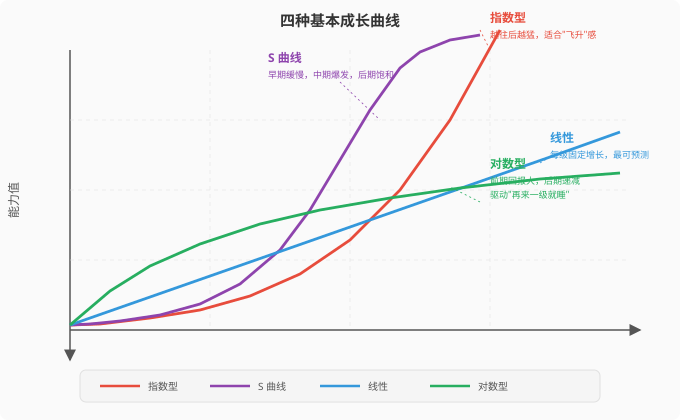
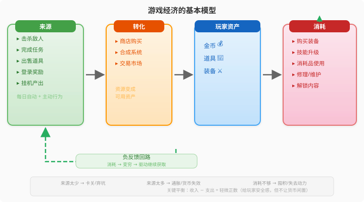
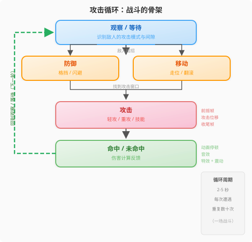

# 第11章：系统设计

> **本章在七步流程中的位置：** 系统设计横跨第3步（原型验证）到第6步（生产开发）。在原型阶段验证系统骨架，在设计深化阶段规划系统之间的接口，在生产阶段落地数值和平衡。系统设计的核心挑战是：**多个子系统叠加后，产生的涌现行为远超设计者的想象。**

---

## 11.1 系统的层次结构

> **这一节解决什么问题：** 当你面对一堆机制时，不知道如何组织成有层次的整体。帮你建立"从元素到体验"的系统思维。

### 为什么需要系统——核心机制是动词，系统是语法

第 10 章定义了核心机制：玩家每秒钟重复的原子动作——跳跃、射击、打出卡牌。这些是**动词**。但一个只有动词的游戏，除了按下按钮看角色蹦起来，什么都做不了。要让动词有意义，你需要**语法**——定义动词的时态（什么时候能跳）、宾语（跳过去干什么）、后果（跳错了会怎样）。这就是系统存在的必要性。

用你已经熟悉的类比来理解"只有 Core Mechanic"和"Core Mechanic + System"的区别：

| 类比 | 只有 Core Mechanic | Core Mechanic + System | 系统做了什么 |
|------|-------------------|----------------------|------------|
| **围棋** | 把一颗棋子放在棋盘上 | 气尽则提（捕获系统）、劫争禁止全局同形（平衡系统）、终局计地（胜负系统） | 三条系统规则把"放棋子"变成了三千年研究不完的策略游戏 |
| **强化学习** | Agent 执行一个动作 a | 奖励函数 R（给分/惩罚）、状态转移函数 T（动作的后果链） | 让"一个动作"变成有学习目标的完整决策环境 |
| **开车上路** | 转动方向盘 | 交通法规（红绿灯、限速、让行）、路网拓扑（高速/小路/死胡同） | 让"转方向盘"变成有约束、有选择的出行行为 |
| **过山车** | 一次俯冲的失重感 | 完整轨道曲线（上升段→俯冲段→回环段→刹车段）、排队系统、安全约束 | 让"一次俯冲"变成起承转合的 2 分钟完整体验 |

> **核心结论：Core Mechanic 定义了"玩家每秒钟做什么"，System 定义了"玩家做了之后会发生什么、下一次做会有什么不同"。** 没有系统的游戏是 Toy（玩具），第 5 章的 Toy First 原则就是让你先验证 Toy 本身是否有趣；确认 Toy 有趣之后，系统就是让 Toy 变成 Game 的方法。Core Mechanic 是骨架层最原子的单元，System 是骨架层更高维度的组织单元。**两者都是骨架——都由设计师直接设计。**

> **涌现的两个层级：** 第 10 章 §10.4 讨论了**机制层涌现**——简单规则通过耦合交互产生的复杂行为（如围棋四条规则 → 三千年棋谱）。本章讨论的是**系统层涌现**——多个子系统（战斗、经济、成长）通过共享资源和跨系统触发碰撞后，产生机制层涌现无法覆盖的行为动态（如"花水晶升级武器还是送给 NPC"的纠结）。机制层涌现是"一个规则系统内部能走多远"，系统层涌现是"规则系统之间能擦出什么火花"。

### 游戏作为系统

*Rules of Play* 对系统的定义是：**一组相互作用、形成统一整体的元素**。任何游戏系统都包含三个基本构件：

| 构件 | 定义 | 独立游戏中的例子 |
|------|------|----------------|
| **元素** | 系统的基本组成单位 | 角色属性、道具、敌人、货币、技能 |
| **关系** | 元素之间的交互规则 | 攻击力影响伤害计算、金币购买道具、等级解锁技能 |
| **环境** | 系统运行的外部上下文 | 关卡空间、时间限制、叙事背景、玩家技能水平 |

> **关键洞察：** 设计师直接设计的是元素和关系，但玩家体验的是**关系运行后产生的涌现行为**。这是第二序设计问题的核心——你只能设计系统，不能直接设计体验。

### 系统与骨架-血肉-灵魂的对应关系

**系统的规则和数据是骨架——设计师直接设计的。系统之间的交互产生的行为动态才是血肉——设计师只能间接塑造。**

| 本书框架 | 对应本章系统模型的什么 | 设计师能直接控制吗 | 详细 |
|---------|---------------------|:---:|------|
| **骨架（机制与规则）** | 机制层 + 系统层的**规则部分** | ✅ 是 | 核心机制（跳跃、射击）**和**系统规则（经济公式、成长曲线、伤害计算）都是设计师直接定义的。战斗系统的伤害公式是骨架，经济系统的 8 步法是骨架，成长曲线的数学方程是骨架。 |
| **血肉（表现与动态）** | 系统层的**交互结果** + 感官反馈 | ❌ 只能间接塑造 | 战斗系统、经济系统、成长系统**各自独立**时，它们只是一堆规则（骨架层）。当它们通过共享资源或跨系统触发**碰撞在一起**时——玩家纠结"花钱买武器还是买药水"——这种纠结本身就是血肉。它不是设计师"写"出来的，而是从规则交互中涌现出来的。 |
| **灵魂（情感与意义）** | 体验层 | ❌ 只能定义目标 | 玩家感受到的完整情绪——节奏、张力、满足感。这是骨架和血肉共同作用后的最终结果。 |

> **一句话：系统规则是骨架（你直接设计它），系统交互是血肉（你只能间接塑造它）。** 设计师的工作是设计系统（骨架）并让系统之间有交界面（共享资源、跨系统触发、约束互锁），然后观察系统交互产生什么样的行为动态（结构性血肉）。

**举例：** 在《Hades》中，战斗系统、好感度系统、商店系统各自都有独立的规则（骨架层）——击中敌人造成 X 伤害、送礼物提升 Y 好感度、商店物品定价 Z 金币。这三个规则本身只是规则。**真正的血肉来自共享资源**：暗黑水晶同时是武器升级、好感度礼物和商人购买的共享消耗品。这条共享规则（骨架）创造了一个情境：每次花水晶，玩家都在三个系统之间做取舍。纠结本身不是设计师"设计"的——它从共享资源规则中**涌现**。它和处决动画的粒子特效一样，都是血肉——只是一个是视觉血肉，一个是结构性血肉。

### 子系统编织的要诀

*Practical Game Design* 强调：子系统不是孤立设计的，而是通过**共同资源**和**冲突目标**编织在一起[Ch6]。三条编织法则：

1. **共享资源竞争：** 同一个资源（金币、时间、精力）被多个系统消耗 → 玩家被迫做选择。*Hades* 中，暗黑水晶同时用于武器升级、好感度礼物和商人购买，三层系统共用一个资源池。

2. **跨系统触发：** 一个系统的输出成为另一个系统的输入。*Stardew Valley*：耕种系统产出作物 → 献祭系统消耗作物 → 献祭结果解锁新区域（探索系统）→ 新区域产出新资源（回到耕种系统）。

3. **系统约束互锁：** 每个系统的设计上限约束了其他系统。战斗伤害上限决定了敌人血量上限，敌人血量上限决定了成长系统的数值天花板。

> **独立游戏的教训：** 小团队最容易犯的错误是设计**孤立系统**——每个系统单独看都合理，但组合在一起没有交互。你做了一个钓鱼系统、一个锻造系统、一个好感度系统，但三者之间没有资源共享、没有跨系统触发——那么它们只是三个迷你游戏拼在一起，不是一个游戏。

### 案例：Dead Cells 的系统编织

*Dead Cells* 的 Roguelike 结构中，系统交互高度紧密：

| 系统 | 做什么 | 与谁交互 |
|------|--------|---------|
| 战斗系统 | 武器攻击、翻滚、招架 | 掉落系统(杀敌掉细胞)、成长系统(武器升级消耗细胞) |
| 掉落系统 | 生成武器卷轴、细胞、金币 | 战斗系统(驱动玩家战斗)、经济系统(金币用途) |
| 成长系统 | 永久升级(细胞解锁)、局内属性(卷轴加点) | 战斗系统(属性影响伤害)、关卡特选(升级解锁新路径) |
| 关卡生成 | 程序化生成地形与敌人 | 成长系统(高难度解锁更多生物群落)、战斗系统(地形影响战斗策略) |

所有系统通过**细胞**和**卷轴**两个共享资源绑定在一起，任何一个系统的数值变化都会牵动整体。*Dummies* 的建议很实用：**用交互图画出每个系统的输入和输出，确保没有一个系统是孤岛**[Ch7]。

---

## 11.2 成长系统设计

> **这一节解决什么问题：** 玩家变强的节奏应该怎么设计？是每升一级猛涨能力，还是越往后越难？何时给新能力，何时让现有能力变得更深？

### 四种基本成长曲线

成长曲线的选择会深刻影响玩家的**情绪节奏**和**留存动力**：

| 曲线类型 | 数学特征 | 玩家感受 | 适用场景 | 典型案例 |
|---------|---------|---------|---------|---------|
| **线性** | `能力 = 基础值 + 增长率 × 等级` | 可预测、稳定，但缺少惊喜 | 对数值精度要求高的系统（如伤害基础值） | XCOM 士兵属性增长 |
| **指数型** | `能力 = 基础值 × 倍数^等级` | 早期弱得憋屈，后期爽得飞起 | 放置/挂机游戏、Roguelite 局内成长 | Vampire Survivors 后期满屏子弹 |
| **对数型** | `能力 = 基础值 × log(等级 + 1)` | 前期每一级都很有感觉，后期需要投入更多时间 | RPG 等级经验表、解锁节奏 | 大部分 MMO 的经验曲线 |
| **S曲线（逻辑斯蒂）** | `能力 = 上限 / (1 + e^(-k(等级-拐点)))` | 自然的学习感：入门慢 → 快速进步 → 逐渐精通 | 技能熟练度、角色成长弧 | 模拟类游戏的技能掌握度 |

> **独立游戏经验法则：** 对数曲线用于**永久升级系统**（让玩家前期快速获得成就感，后期每个新能力更有意义）；S曲线用于**局内技能成长**（模拟"学习→掌握"的真实过程）。

### 新能力 vs 深能力：何时给什么

*Rules of Play* 的信息理论提供了一个决策框架：**新能力 = 新信息（拓宽可能性空间）；深能力 = 信息密度增加（深化现有可能性空间）。**

| 阶段 | 应该给 | 为什么 | 反面教材 |
|------|--------|--------|---------|
| **前5分钟** | 1-2个核心动作，立即能用 | 确立"这个游戏是关于什么的" | Brotato 第一波就给 4 种武器——新玩家无法处理 |
| **前30分钟** | 每 3-5 分钟一个**新能力**，拓宽玩法认知 | 玩家需要"发现"这个游戏有多深 | 前3小时只有普攻的 RPG——玩家的核心预期未被满足 |
| **30分钟-2小时** | 新能力频率降低；开始给**深能力**（升级/变异/组合） | 深度比广度更能留住中期玩家 | Slay the Spire 的做法：2-3层后新卡牌变少，但遗物组合变丰富 |
| **2小时后** | 主要给深能力；偶发**质变型新能力**（解锁新玩法维度） | 维持新鲜感但不再增加认知负荷 | Hades 到后期开启武器形态——一个质变新能力让老内容焕然一新 |

> **判断标准：** 如果玩家在使用一个能力时不需要思考"我该用它还是用另一个"，那这个能力就是冗余的。*Practical Game Design* 的精炼表述：**深度 = 有意义的选择数量，不是操作数量**[Ch6]。

### 成长系统的骨架-血肉-灵魂三层

| 层 | 检查项 |
|----|--------|
| **骨架（机制）** | 成长曲线类型选对了吗？数值天花板是否与游戏长度匹配？新能力与深能力的节奏是否合理？ |
| **血肉（反馈）** | 升级瞬间是否有满足反馈？成长效果是否**肉眼可见**（而非只是数字变化）？ |
| **灵魂（体验）** | 玩家变强后是否感受到"身份提升"？成长是否与叙事一致（如角色从新手到大师）？ |

---

## 11.3 经济系统设计

> **这一节解决什么问题：** 游戏里的金币/水晶/魂到底该怎么设计？太多 → 通货膨胀、失去动力；太少 → 卡关、挫败。教你用"来源→转化→消耗"模型搭建可控的游戏经济。

### 游戏经济的基本模型

所有游戏经济——从*动物森友会*的铃钱到*暗黑破坏神*的金币——都遵循一个简单结构：

**三个环节的平衡是关键：**

| 环节 | 太少的结果 | 太多的结果 |
|------|-----------|-----------|
| **来源** | 玩家卡关、挫败、放弃 | 通货膨胀、货币失去意义 |
| **转化** | 玩家不知道自己该买什么、选择少 | 选择瘫痪、系统复杂到无法理解 |
| **消耗** | 货币堆积、失去继续玩的动力 | 玩家永远穷困、无法体验全部内容 |

> **经济学类比：** 设计游戏经济 = 设计一个小型国民经济。如果货币只进不出（来源源源不断但消耗跟不上），就会通货膨胀——游戏里的面包从 10 金币涨到 100 金币，因为市场上金币太多了。

### 虚拟经济构建的 8 步法

*Dummies* 给出了一个清晰的步骤。加上独立游戏的实践调整：

| 步骤 | 做什么 | 独立游戏特别注意事项 |
|------|--------|---------------------|
| **1. 选择主货币** | 确定 1-2 种核心货币（太多了干扰决策） | 独立游戏 ≤ 2 种货币。1 种游戏内货币（金币）+ 1 种稀有货币（魂/水晶）就够了。3 种以上 = 你在做 F2P 而非独立游戏。 |
| **2. 给资源定价** | 确定每个资源/道具的基础价值 | 用"1 金币 = 1 次基础攻击的收益"做锚点。所有价格围绕这个锚点浮动。 |
| **3. 定义稀有度阶梯** | 普通→稀有→史诗→传说，带明确价格跳变 | 稀有度不是越华丽越好。每个阶梯需要**质的差异**——不仅是数值翻倍，而是新能力/新外观/新机制。 |
| **4. 设计获取渠道** | 战斗掉落、任务奖励、探索发现、产出建筑 | 确保**至少 2 条不同来源路径**通向同一种稀缺货币（防止玩家被单一玩法卡死）。 |
| **5. 设计消耗口** | 升级费、修理费、解锁费、合成费、购买 | **消耗口 ≥ 来源渠道数**——这是经济平衡的第一铁律。每次新增一个产生金币的系统，至少新增一个消耗金币的系统。 |
| **6. 平衡供需** | 调掉落率、调价格，让"每日收入 ≈ 每日合理支出" | 用电子表格模拟：假设玩家每天玩 30 分钟，他合理的收入 - 合理支出 = 略为正数（给玩家存钱的安全感）。 |
| **7. 周期性更新** | 新道具、新消耗口 | 独立游戏不需要 GaaS 频率。但至少要预留 1-2 个"终局消耗"（如深度升级、收集目标），避免玩家通关时身上有花不完的货币。 |
| **8. 防通胀措施** | 价格上限、回收机制、税收 | 最简单的独立游戏方案：**自然衰减**——高级道具贵很多但强一点（边际收益递减），让追求完美的玩家自然烧钱。 |

### 经济系统平衡检查表

| 检查项 | 通过标准 | 失败时的信号 |
|--------|---------|-------------|
| 来源多样性 | 至少有 2 种不同的获取每种核心货币的方式 | 玩家抱怨"只能刷同一个副本" |
| 消耗口充足 | 消耗口数量 ≥ 来源渠道数 | 玩家到中后期"钱没地方花" |
| 每日净收入 | (来源 - 消耗) × 典型时长 = 略正 | 负数 = 卡关；很大正数 = 通胀 |
| 边际效用递减 | 第 N+1 级升级的成本 ≥ 第 N 级的 1.2 倍 | 玩家前期太简单、后期太难 |
| 没有无限套利 | 所有交易路径中，A→B→C→A 不能产生净收益 | 玩家发现刷钱漏洞后经济崩溃 |
| 货币不闲置 | 游戏终局前，玩家持有的货币量 ≤ 下一个大消耗点的 80% | 通关时货币量达到上限 |

### 案例：Slay the Spire 的极简经济

*Slay the Spire* 的经济极度简洁：**唯一的货币是金币**，来源是战斗奖励和事件，消耗是商店购买和事件支付。但它平衡了三个关键：

1. **金卡（金币+遗物+药水+卡牌）的共享决策**：每一分钱都有一个机会成本——你花 200 金币买遗物，就意味着你不能移除卡牌。选择之间的张力 = 经济系统的灵魂。

2. **商店的出现频率锁定**：每层最多遇到一个商店（约 5-7 个节点），所以**金币的消耗窗口是稀缺的**。你不会有钱花不掉，也不会永远花不够。

3. **事件做经济调节器**：某些事件让你"花钱消灾"（买遗物/移除卡牌），某些事件是"随机交易"（放弃一张牌换另一张），这些事件充当了**经济缓冲器**，吸收剩余金币或提供额外金币。

> **独立游戏的教训：** 经济系统不在于"有多少种货币"，而在于**每一种货币都有不可替代的用途**和**有限的使用机会**。1 种货币 + 3 个相互竞争的消耗口 > 5 种各管一摊的货币。

---

## 11.4 战斗系统设计

> **这一节解决什么问题：** 战斗不只是"打中扣血"。帮你从攻击循环、防御机制、伤害计算三个维度拆解战斗系统，让战斗既有深度又有手感。

### 攻击循环：战斗的骨架

*通关！* 将战斗拆解为三个最基本形式：**防守、攻击、移动**[第10关]。所有复杂战斗系统都是这三者的排列组合和节奏编排。

*通关！* 特别强调战斗时机的四个关键点：

| 关键点 | 原则 | 常见错误 |
|--------|------|---------|
| **前摇（启动帧）** | 必须有足够帧数让玩家和敌人都能**读到攻击意图** | 0帧起手 → 玩家感觉"被打中是不公平的" |
| **攻击位移** | 攻击动画中角色应**向前微微移动** | 原地攻击 → 被击退的敌人刚好落在攻击范围外，永远打不中 |
| **收尾帧** | 越强力的攻击，收尾帧越长（风险与回报） | 所有攻击收尾帧一样长 → 无差异化，玩家只用最快的那招 |
| **受击反馈** | 动画停顿 + 音效 + 特效 + 镜头微震 → 四层叠加 | 只有数字飘出 → 打中像打在空气上，没有手感 |

### 防御机制选择矩阵

防御设计决定了游戏的节奏和风险结构。四种基本防御机制及适用场景：

| 防御机制 | 机制描述 | 风险 | 技能天花板 | 适用游戏 |
|---------|---------|------|-----------|---------|
| **格挡** | 特定时机按键，抵消伤害 | 低（格挡失败 = 原地站立挨打） | 中 | 动作 RPG、2D 平台格斗 |
| **闪避/翻滚** | 移动规避，临时无敌帧 | 中（翻滚方向错了照样挨打） | 高（方向选择是深度来源） | Souls-like、动作 Roguelite |
| **招架/弹反** | 精确时机反击，伤害+硬直 | 高（弹反失败 = 吃全套连招） | 极高 | 只狼、Dead Cells |
| **被动防御（护甲/护盾）** | 数值减伤，不需操作 | 最低（但降低了交互密度） | 低 | 策略 RPG、回合制 |

> **独立游戏的设计陷阱：** 不要把四种防御机制全塞进一个游戏。*Dead Cells* 只用了**格挡+翻滚**，*只狼*只用了**格挡+弹反+闪避**（且三者的使用场景有明确区分）。一个防御机制要做到极致，好过四个机制的泛泛而做。

### 伤害计算公式的选择

伤害计算看似简单，但公式的选择直接决定了**每个属性的边际价值**和**玩家的配装策略**。三种主流公式：

| 公式类型 | 表达式 | 效果 | 适用场景 |
|---------|--------|------|---------|
| **减法公式** | `伤害 = 攻击力 - 防御力` | 攻防差值线性影响伤害，防御值的边际效用恒定 | 固定数值系统、PvE 为主 |
| **百分比减伤** | `伤害 = 攻击力 × (1 - 减伤率)` | 防御的边际效用递增（从0%减伤到10%价值 < 从80%到90%） | 有明确职业分工（坦克/DPS） |
| **混合公式** | `伤害 = 攻击力² / (攻击力 + 防御力)` | 攻防均有边际递减，但都不为0 | 有动态数值成长的游戏 |

> **实践经验：** 独立游戏推荐**混合公式**或其变体。减法公式容易导致"破防临界点"问题（防御比攻击高 1 点 = 无敌；攻击比防御高 1 点 = 碾压），百分比公式容易导致防御无限堆叠。混合公式保证了在任何攻防比例下都有可玩性。

### 案例：Hollow Knight 的战斗极简主义

*Hollow Knight* 的战斗系统是"减法设计"的教科书案例——它去掉了几乎所有独立游戏"以为需要"的机制：

**它没有的：** 格挡、弹反、主动闪避（有被动无敌帧的冲刺）、连招系统、技能冷却、属性加点、防具系统。
**它有的：** 平A（四方向）、冲刺（带无敌帧）、跳跃、法术（灵魂消耗，无冷却）、护符系统。

但它的战斗深度来自：

1. **护符系统 = 玩家自选的防御机制菜单。** 你可以选更长无敌帧（冲刺大师）、自动格挡（巴德之壳）、反伤（荆棘护符）、加血上限——但你只能同时装备有限的护符槽。**防御机制由玩家组装，而非设计师预设。**

2. **灵魂的双重用途 = 经济在战斗中的微缩版。** 击杀 = 获得灵魂。灵魂 = 回血或放法术。每一次获得灵魂都面对选择：现在回血（防御）还是存着放法术（进攻）？这是战斗内经济系统的黄金标准。

3. **Boss 的节奏编排 = 观察→防御→攻击循环的最佳示范。** 每个 Boss 有 3-5 种攻击模式，间隔固定，播放明确的视觉/音效提示。玩家逐次学习"看到这个信号 → 该这样反应 → 这里有攻击窗口"。这种学习过程本身就是玩法。

---

## 11.5 反馈系统与负反馈回路

> **这一节解决什么问题：** 你的游戏为什么要么太无聊（没悬念）要么太绝望（追不上）？反馈回路是游戏动态平衡的隐形之手——设计好坏直接决定"再来一局"的冲动。

### 正反馈 vs 负反馈：一张表说清楚

*Rules of Play* 对反馈回路的定义和分类是本章的核心理论基础[Ch18]：

| 维度 | 正反馈回路 | 负反馈回路 |
|------|-----------|-----------|
| **作用方向** | 放大差异，强者更强 | 缩小差距，弱者有翻盘机会 |
| **通俗理解** | 雪球效应/滚雪球 | 橡皮筋效应/兜底机制 |
| **对游戏的影响** | 加速结束，让领先者更快获胜 | 延长悬念，让落后方保持希望 |
| **太多了会怎样** | 前5分钟的优势 = 无法翻盘的胜利（"垃圾时间"） | 努力没有意义，反正系统会帮你兜底（"被系统支配"） |
| **太少了会怎样** | 游戏随机化严重，领先毫无安全感 | 游戏永远分不出胜负（足球踢了 3 小时还是 0:0） |
| **理想比例** | 让游戏**有方向**——优势会积累但不能锁定 | 让游戏**有悬念**——劣势可逆转但不能抹杀优势 |

### 经典游戏中的反馈回路分析

| 游戏 | 正反馈 | 负反馈 | 平衡评估 |
|------|--------|--------|---------|
| **马里奥赛车** | 领先者获得更好道具？（实际是反的） | 名次越低，获得道具越强（蓝龟壳、加速蘑菇） | 负反馈过强——故意掉到第12名再冲第1是有效策略 |
| **文明系列** | 领先文明科技更快、领土更大、资源更多 | 城邦任务、世界议会可以制裁领先者 | 正反馈偏强——中期落后很难逆转，但不如SLG极端 |
| **Hearthstone** | 场面优势 → 更安全的输出空间 → 更大的场面优势 | 疲劳伤害、有限的卡牌资源、AOE清场 | 正反馈适中——翻盘依赖特定卡牌，但确实存在翻盘手段 |
| **Dark Souls** | 魂越多升级越快 → 打怪更强 → 魂来得更快 | 死亡惩罚（掉魂）、篝火重置敌人、敌人不随玩家等级变强 | 负反馈温和——死得越多，回到魂的路上越小心，学得越多 |
| **Tetris** | 消行越多 → 速度越快 → 犯错可能性越大 | 方块天然随机（你无法控制下一块）、速度增长最终超出人类能力 | 天然平衡——正反馈（速度增长）就是负反馈（更难生存） |

### 独立游戏最常见的反馈系统错误

| 错误类型 | 表现 | 如何诊断 | 修复方法 |
|---------|------|---------|---------|
| **纯正反馈雪球** | 前 2 分钟领先的玩家锁定胜局，剩下的时间是垃圾时间 | 统计"开局领先者在第 5 分钟仍领先"的概率。>90% = 正反馈过强 | 给落后方加速资源生成、降低领先方收入系数 |
| **纯负反馈兜底** | 玩家学会"先落后再反超"是最优策略 | 观察是否有玩家故意在早期输掉以获得更好的兜底 | 负反馈给予的是**翻盘机会**而非**翻盘保证**；兜底帮到持平为止，不要帮到反超 |
| **无反馈回路** | 比分随机波动，玩家感受不到自己的决策影响了结果 | 统计最终排名与中期排名的相关系数。<0.3 = 太随机 | 增加可积累的永久优势（即使很小），确保"更强的发挥=更多的回报" |
| **反直觉的负反馈** | 负反馈在玩家层面不可见 → 玩家感觉"系统在操控" | 玩家能说出"我觉得领先时好像更容易被打中"就是信号 | 让负反馈**可见且可理解**——Mario Kart 的道具是显式的，"你落后所以给你好道具"是玩家能接受的故事 |

> **核心原则：** *Rules of Play* 指出，游戏设计需要同时使用两种反馈回路——**正反馈确保游戏会终结，负反馈确保终结前的每一分钟都是悬念**。如果一个游戏结束不了（无正反馈）或结束了但过程中没有紧张感（无负反馈），就是反馈回路的设计失败。

### 反馈系统的骨架-血肉-灵魂三层

在设计反馈回路时，不仅是数值，还有三个层面需要同时考虑：

| 层 | 设计要点 |
|----|---------|
| **骨架（机制）** | 正反馈和负反馈各自是什么机制？系数/触发条件是否合理？是否存在极端情况（完美开局/完美落后）让回路断裂？ |
| **血肉（表现）** | 反馈是否让玩家**感知到**？落后时屏幕边缘变红？领先时音乐加速？正负反馈不能只有后台数值，必须有可感知的视听信号。 |
| **灵魂（体验）** | 反馈是否与游戏的主题一致？恐怖游戏的正反馈（生存越久武器越好）可以弱一些（绝望感是体验目标）；竞速游戏的负反馈不能太强（领先是核心欲望）。 |

### 案例：Mario Kart 与 Vampire Survivors 的反馈对比

**Mario Kart（强负反馈，弱正反馈）：** 这是负反馈主导设计的极端案例。领先者只能获得香蕉皮和绿龟壳（弱道具），落后者能获得蓝龟壳、黄金蘑菇、闪电（强道具）。这种设计的结果是：**没有人能安全领先，每场比赛的最后一圈都有悬念。** 缺点是：高水平的玩家会刻意保持在第 2-3 名，避开蓝龟壳，最后一圈再冲刺。

**Vampire Survivors（强正反馈，几乎无负反馈）：** 这是正反馈主导设计的极端案例。击杀越多 → 经验越多 → 升级越快 → 武器越强 → 击杀更多。前 5 分钟玩家在废墟中颤抖，后 25 分钟玩家站在屏幕中央不动，全屏敌人被自动消灭。这个设计是**故意的**——爽感来自从"被追着跑"到"我就是风暴"的成长弧。负反馈的缺失由**每局 30 分钟的固定时长**弥补（不需要橡皮筋，因为时间到了自动终结）。

> **两个极端都成功了——但前提是它们知道自己的反馈回路是什么，以及为什么这样设计。** 最危险的是**无意识地复刻别人的反馈系统**：你把 Vampire Survivors 的正反馈强度用在 PvP 格斗游戏中，5 秒后比赛就结束了。

---

## 实操清单

- [ ] 画出你游戏中所有子系统的交互图（每个系统的输入来自哪些系统、输出流向哪些系统）。确保没有一个系统是信息孤岛。
- [ ] 选择核心成长曲线类型（线性/指数/对数/S曲线），并画出玩家在第5分钟、第30分钟、第2小时的能力值——三个数字是否在合理范围内？
- [ ] 列出每种货币的来源渠道和消耗口。消耗口数量 ≥ 来源渠道数。
- [ ] 用电子表格跑一遍"每日 30 分钟玩家"的经济模拟：收入 - 支出 = 轻微正数。
- [ ] 战斗系统：明确列出攻击前摇帧数、位移距离、收尾帧数。三种攻击必须有数值上的差异化（不只是伤害不同）。
- [ ] 确认战斗的防御机制 ≤ 2 种。超过就砍。
- [ ] 列出游戏的正反馈和负反馈各是什么。如果只有一种，你需要添加另一种。
- [ ] 模拟一场"完美开局"和一场"完美落后"——极端情况下你的反馈回路是否仍然有效？

---

## 失败信号

| 信号 | 意味着 |
|------|--------|
| 你能画出子系统图，但有 2 个以上系统没有跨系统输入/输出 | 你在做孤立系统，它们不会产生涌现玩法的乐趣 |
| 成长曲线的"5分钟→30分钟→2小时"三段数值相差 <20% | 玩家感受不到成长。曲线太平坦了 |
| 测试中玩家到中后期说"钱已经没用了" | 消耗口不够。你需要一个新的货币消耗方式 |
| 3 个以上 playtest 玩家不知道某个攻击比另一个"好在哪" | 攻击差异化不够——不只是数值不同，手感/用途/场景必须不同 |
| 玩家能准确说出"我感觉领先时就容易输" | 你的负反馈在数值层面有，但表现层不可见，变成了"系统在耍我" |
| 领先者在 5 分钟内胜率 >90% | 正反馈过强。需要负反馈介入 |
| 玩家学会"故意落后以获得优势" | 负反馈过强。降级负数，保留翻盘机会但不替代正反馈 |
| 战斗中只使用了一种防御方式 | 你的防御机制有最优解，其他都是摆设 |

---

## 骨架-血肉-灵魂自查

| 层 | 自查问题 | 通过标准 |
|----|---------|---------|
| **骨架（机制与规则）** | 子系统交互图是否闭环？每个系统是否有输入来源和输出去向？ | 没有一个系统是信息孤岛 |
| **骨架（机制与规则）** | 成长曲线数值是否经过电子表格验证？经济来源-消耗是否平衡？ | 模拟 30 分钟玩家：收入 - 支出 = 轻微正数 |
| **骨架（机制与规则）** | 伤害公式是否避免了"破防临界点"？正负反馈回路是否同时存在？ | 极端情况下（完美开局/完美落后）反馈回路仍然有效 |
| **血肉（表现与动态）** | 升级瞬间是否有不可错过的视听反馈？货币增减是否全程可见？ | 测试者不看 UI 数字也能感知到"变强了"或"变穷了" |
| **血肉（表现与动态）** | 攻击命中有多层次的反馈（音效+特效+镜头+震动）？正负反馈的表现是否让玩家知道"我正在领先/落后"？ | 玩家能准确说出自己当前处于优势还是劣势 |
| **血肉（表现与动态）** | 子系统之间是否存在共享资源竞争或跨系统触发，产生了"有意义的两难选择"？ | 测试者在资源分配时表现出纠结，且不同测试者做出了不同选择 |
| **灵魂（情感与意义）** | 成长的终极幻想是什么（从弱小到强大？从菜鸟到宗师？）？ | 用一个词能描述成长带来的情感变化 |
| **灵魂（情感与意义）** | 经济的紧张感/富足感是否与游戏主题一致？ | 生存游戏不缺钱 = 灵魂断裂；富裕的经营游戏缺钱 = 灵魂断裂 |
| **灵魂（情感与意义）** | 战斗的节奏是否传达了游戏的核心情感（紧张/爽快/策略）？ | 测试者描述战斗时的情绪词与 Design Pillars 一致 |
