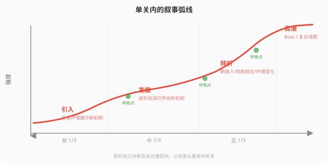
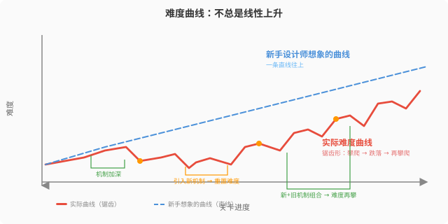

# 第13章：关卡设计

> **本章在全书中的位置：** 第10-12章分别覆盖了核心机制、系统设计和叙事设计——它们是"玩家做什么"和"为什么做"。本章进入"在哪做"：关卡设计是将所有设计元素落地为可玩空间的艺术。它不属于七步流程中的特定一步，而是横跨 Step 4（设计深化）到 Step 7（迭代打磨）的持续性工作。

> **编程类比：** 关卡设计 ≈ 写了一个函数后，设计它的测试用例和调用上下文。机制是函数本身，关卡是喂给这个函数的不同输入——好关卡不是"漂亮的背景"，是**精心编排的参数序列**，让同一个核心机制在不同约束下展现不同风味。

---

## 本章解决什么问题

大多数新手的关卡设计方式是"先搭一个走廊，往里塞敌人，终点放个门"。结果：玩家机械地穿过走廊、打死敌人、推开门——整个过程没有任何记忆点。这不是"关卡设计"，这是"把素材摆进空间里"。

真正的关卡设计回答三个递进问题：
1. **宏观：** 这一关在整个游戏流程中承担什么功能？（是教新机制？是测试熟练度？还是提供高潮释放？）
2. **中观：** 玩家在这一关中的情绪应该怎么走？（紧张→放松→再紧张→最终释放）
3. **微观：** 每一个拐角、每一道光、每一个地标——玩家凭什么知道往哪走？

本章从宏观到微观，提供一个完整的关卡设计工具箱。

---

## 13.1 关卡设计的科学流程

> **这一节解决什么问题：** "怎么开始做一个关卡"是最令人瘫痪的问题。空白编辑器比空白画布更可怕——因为你不只要画，还要让空间"产生玩法"。本节提供从宏观世界地图到微观单关布局的四阶段流程，作为可调整的开工路径。

### 从宏观到微观：三层设计粒度

关卡设计不是从一个房间开始的。是从一整张世界地图开始的。

```
世界地图（World Map）
    │  定义：整个游戏的空间结构——各区域之间的关系、解锁顺序、主题分布
    │  工具：节点图 / 地铁图风格的流程线
    │  回答：玩家从哪开始？经过哪些区域？终点在哪？
    ↓
区域流程（Region Flow）
    │  定义：一个区域内若干关卡/场景的排列顺序和导航逻辑
    │  工具：流程图 + 节奏标注（标出每个节点的"体验类型"和"强度等级"）
    │  回答：这个区域的"情绪弧线"是什么？
    ↓
单关布局（Level Layout）
    │  定义：单个关卡/场景内部的空间结构、敌人物件分布、路径与目标
    │  工具：俯视草图（Top-Down Sketch）→ 灰盒（Graybox）
    │  回答：玩家在这个空间里实际做什么、看什么、感受什么？
```

**案例：*Celeste* 的三层结构**

| 层次 | Celeste 的实际表现 |
|------|------------------|
| **世界地图** | 章节选择界面——每章对应一座山的不同区域（城市废墟 → 山脚 → 云端 → 山顶）。玩家可以直观理解"我在爬山"，每章是一个阶段性的攀登目标 |
| **区域流程** | 每章内部由若干"屏幕"（单屏关卡）组成，通过过渡动画连接。节奏是"高强度跳跃屏幕 → 安全平台 → 再高强度 → 对话/休息区" |
| **单关布局** | 每个屏幕是一个精确编排的跳跃谜题——敌人、平台、刺的摆放位置精确到像素。玩家必须在"看→想→做→死→重来→成功"的短循环中完成 |

*Celeste* 提供了一个“空间细节服务于操作意图”的案例；并非所有关卡都需要把每个像素都精确编排。

### 关卡设计四阶段流程

*Practical Game Design* 第 9 章将关卡设计分解为多个阶段，本书将其凝练为四个常用步骤；项目可根据类型、工具和团队规模合并或拆分：

| 阶段 | 名称 | 产出 | 时间占比 | 核心动作 | 跳过此阶段的后果 |
|------|------|------|---------|---------|----------------|
| **1** | **概念（Concept）** | 一句话关卡目标 + 核心体验关键词 | 按项目调整 | 明确这一关要玩家感受到什么、学会什么 | 关卡没有"灵魂"——只是素材的随机排列 |
| **2** | **草图（Sketch）** | 俯视平面图，标注玩法节拍、敌人位置、路径、关键物件 | 按项目调整 | 在纸上或绘图软件中画出空间流程和玩法分布 | 灰盒阶段方向不明，反复推翻布局 |
| **3** | **灰盒（Graybox）** | 在引擎中用简单几何体搭建可玩版本，无美术资产 | 通常是主要设计验证阶段 | 用方块和圆柱搭建空间，放入核心玩法和敌人，反复测试 | 美术返工——发现墙体位置不对时已经画好了贴图 |
| **4** | **迭代（Iteration）** | 替换美术、调数值、加反馈、修碰撞——直到达标 | 按风险和目标调整 | 在可玩基础上抛光：光照、音效、VFX、难度微调 | 关卡"能玩"但"不好玩"——玩家说不出原因，就是不想继续 |

**灰盒为什么通常占主要时间？** 因为灰盒是“设计真正发生的阶段”。概念和草图是假设，灰盒是实验——只有在可玩版本中，你才能发现“这个走廊太长了”“这个拐角的敌人玩家永远看不清”“从 A 点到 B 点走了很久但无事发生”。具体时间取决于关卡复杂度和工具成熟度。

**纪律：先验证影响核心体验的空间，再投入不可逆的美术工作。** *Practical Game Design* 明确警告：在关卡布局验证之前就投入大量美术资产，会放大返工成本。灰盒阶段应保留足够的可逆性；必要时也可以用代表性美术样本同步验证可读性和品质。

> *通关！* 的补充："水平分层构建法"是另一种思路——同时搭建所有关卡的灰盒层，然后逐层添加交互、敌人、美术——适合资源充足的团队。对于独立开发者，"垂直切片"法更实用：把一个关卡从灰盒做到最终品质，测出真实产能，再推广到其余关卡。

---

## 13.2 关卡节奏与难度曲线

> **这一节解决什么问题：** "玩到一半就不想玩了"——这是关卡节奏失败的典型症状。节奏不是"把敌人均匀分布在关卡里"，而是让玩家的情绪像一首歌——有主歌、有副歌、有间奏、有终章。

### 单关内的叙事弧线：引入 → 发展 → 转折 → 高潮

一个关卡内部的情绪变化，应该遵循一条清晰的弧线。这不是文学修辞——它直接映射到玩家的行为和生理状态。



**每个阶段的设计任务：**

| 阶段 | 位置 | 设计内容 | 错误做法 |
|------|------|---------|---------|
| **引入** | 前 1/3 | 安全环境展示新机制/敌人。玩家在此失败代价低，可以放心试错 | 一上来就把玩家扔进复杂战斗——没有任何铺垫的高难度 = 不是"挑战"，是"劝退" |
| **发展** | 中 1/3 | 逐步加深——更多敌人、更快节奏、更窄操作窗口。玩家在此时形成"肌肉记忆" | 难度平直无变化——"太简单"比"太难"更致命，因为它连情绪都没有 |
| **转折** | 中后段 | 改变规则——引入新敌人类型、新环境危险、或强制玩家用刚学会的技能应对一个全新情境 | 转折后立刻回到原难度——转折是加速，不是插播广告 |
| **高潮** | 最后 1/4 | 综合挑战——要求玩家使用本关学会的所有技能。通常以 Boss 战、复合谜题或时间压力结束 | 高潮不够"高"——打完感觉"就这样？"比打不过更破坏体验 |
| **呼吸点** | 各阶段之间或高强度之后 | 安全的过渡空间——无敌人、有资源、有景观。让玩家从上一个紧张段落中恢复 | 缺少呼吸点，玩家的注意力和操作精度可能持续下降 |

**案例：*Celeste* 第一章的单关弧线**

| 弧线阶段 | Celeste 第一章的设计 |
|---------|-------------------|
| **引入** | 第一个屏幕：只有地面和一面可爬的墙。玩家自然学会"跳跃→爬墙→再跳"。无敌人、无惩罚 |
| **发展** | 第 3-5 屏幕：引入 dash（空中冲刺）→ 逐渐加宽裂隙 → 增加移动平台。每个新元素先单独出现，再与之前的元素组合 |
| **转折** | 第 6 屏幕：第一次遇到"会移动的刺块"——玩家必须将已有的跳跃+冲刺技能应用于一个动态威胁。上一秒的安全策略（"先看再跳"）失效了 |
| **高潮** | 最后 2 个屏幕：多个移动刺块 + 连续 dash 间隙 + 几乎没有站立空间。玩家必须把本章学到的每个技能组合成流畅的动作链 |
| **呼吸点** | 每 3-4 个屏幕后有一个无威胁的平台或一个简短的对话场景。草莓收集（可选的更难路线）也是呼吸的一种——"风险自选"让玩家自己控制节奏 |

### 难度曲线：不总是线性上升

难度曲线最常见的误解是**"越往后越难"**。这不仅无聊，而且错误。



**锯齿形难度曲线：攀爬 → 跌落 → 再攀爬**

| 曲线形状 | 含义 | 案例 |
|---------|------|------|
| **攀爬** | 当前机制逐渐加深——更多敌人、更快的节奏 | 玩家连续攻克 3 个屏幕，感觉越来越得心应手 |
| **突然跌落** | 引入一个全新机制/敌人——玩家在新规则面前重新变为"新手" | 第一次遇到会飞的敌人——之前的站位策略失效了 |
| **再攀爬** | 在新规则下重新建立掌控感——这一次攀爬建立在已有技能+新技能的组合之上 | 学会应对飞行敌人后，关卡同时出现地面敌人 + 飞行敌人 |

**这个模式的深层原理：** 难度跌落不是"让游戏变简单"——它是**引入新的复杂度维度**。当玩家刚熟悉了 X 轴的威胁（地面敌人），Y 轴的威胁（飞行敌人）强制他们重建空间认知。这时候如果地面敌人的难度也继续上升，玩家就会崩溃。所以——**每次引入新维度时，已掌握维度的难度应该暂时降低**，给玩家消化新维度的认知带宽。

*Practical Game Design* 第 11 章的 Flow 理论（Csikszentmihalyi）在这里直接适用：**难度必须匹配玩家当下的技能水平。** 每次引入新机制时，玩家技能水平会暂时下降——他们需要重新学习。难度跌落就是对这个"学习期"的适应。

### 关卡节奏标注法：给每个"区块"打标签

在俯视草图上，用不同颜色或标签标注每个区块的"体验类型"和"强度等级"：

| 体验类型 | 标签 | 强度 1-5 | 典型时长 | 设计特征 |
|---------|------|---------|---------|---------|
| **教学** | T | 1-2 | 按机制复杂度和玩家熟悉度 | 安全环境、单一新机制、失败成本可控 |
| **探索** | E | 1-3 | 按空间规模和目标节奏 | 多路径、隐藏物、景观展示 |
| **战斗** | C | 2-4 | 按遭遇复杂度和战斗节奏 | 敌人配置、地形利用、资源消耗 |
| **解谜** | P | 2-4 | 按推理复杂度和提示策略 | 环境交互、逻辑推理、无时间压力 |
| **平台跳跃** | PL | 2-5 | 按操作窗口和失败成本 | 精确操作、反复重试、短失败循环 |
| **叙事/对话** | N | 1 | 按信息量和情绪节奏 | 无操作或轻操作、情绪释放、信息传递 |
| **Boss/高潮** | B | 4-5 | 120-300s | 复合挑战、技能综合测试、高情绪投入 |
| **呼吸/过渡** | R | 1 | 15-30s | 无威胁、资源补给、景观放松 |

**标注后，检查节奏：**
- 是否有连续 3 个以上同类型高强度的区块？（→ 需要插入呼吸点或类型切换）
- 是否有连续 2 个以上叙事区块无操作？（→ 玩家会开始按跳过键）
- Boss 前是否有至少一个"技能预热"区块？（→ 如果没有，玩家第一次面对 Boss 时用的是"冷手"）
- 每种类型在本关中是否至少出现一次？（→ 如果只有战斗，这是一关"战斗走廊"，不是关卡）

---

## 13.3 空间引导方法

> **这一节解决什么问题：** 玩家迷路了——不是因为"方向感差"，而是因为你的关卡没有提供足够的方向信息。引导不是"给玩家画一条线让他们跟着走"，而是**让玩家觉得"是我自己找到了路"**，尽管这条路是你精心铺好的。

### 引导的两种基本形态

```
                空间引导
                   │
        ┌──────────┴──────────┐
        │                     │
    显性引导               隐性引导
  (玩家知道在        (玩家不自觉被
   被引导)              引导)
        │                     │
   ┌────┼────┐          ┌────┼────┐
   │    │    │          │    │    │
  箭头 地图 文字      光线 色彩 地标
  UI   小地 任务      明暗 对比 形状
  标记 图   提示      对比 区分 剪影
```

### 显性引导技术：直接告诉玩家去哪

显性引导的优势是**零歧义**，代价是**破坏沉浸感**。使用原则是"能不用就不用，但必须引导时不要含糊"。

| 技术 | 适用场景 | 设计要点 | 经典案例 |
|------|---------|---------|---------|
| **箭头/标记** | 开放世界、复杂建筑、多楼层 | 只在玩家真正可能迷失时出现；提供关闭选项 | *Dead Space* 的"按 RS 显示路径"——玩家主动操作时才出现，不常驻屏幕 |
| **小地图/雷达** | 多路线关卡、大型空间 | 标注关键目标，但不过度标注次级内容（留给探索） | *Dark Souls* 无小地图——用空间本身做引导（见隐性引导） |
| **任务文字** | 目标不直观的关卡 | 用"目的"语言而非"操作"语言（"找到离开的路"而非"走到地图右上角"） | *Portal* 的 Glados 语音——任务用叙事包装，不打断操作 |
| **UI 标记** | 可互动物品的位置提示 | 只在近距离出现，不把"寻找"变成"扫描" | *The Witcher 3* 的 Witcher Sense——按一下才高亮，不是一直亮着 |

### 隐性引导技术：让玩家自己"发现"路

隐性引导是关卡设计的"暗线"——玩家不觉得自己在被引导，但他的目光和脚步被精密地操控着。*实践中的关卡设计* 第 9 章将光线列为最重要的隐性引导工具。

| 技术 | 原理 | 设计方法 | 经典案例 |
|------|------|---------|---------|
| **光线引导** | 人眼自然被亮处吸引。在较暗的环境中，亮处 = "往这走" | 在关键路径入口处放置比其他区域更亮的光源；用明暗对比制造"这是正确答案"的直觉 | *INSIDE* 几乎全关靠光线引导——玩家身处黑暗，远处的光亮就是目标方向 |
| **色彩引导** | 颜色产生语义联想：暖色=前进/安全/重要，冷色=后退/危险/背景 | 可互动的路径/物件用暖色调；不可通行的区域用低饱和冷色；始终保持色彩语言一致性 | *Mirror's Edge* 的"Runner Vision"——可攀爬物体用鲜红色，其他用白色/灰色 |
| **地标引导** | 远处的独特建筑/景观作为一个“北极星”——帮助玩家建立空间位置感 | 在关卡入口或关键节点让地标可见；是否始终保持在视野中，以及是否需要独一无二的形状，由空间结构和测试决定 | **Dark Souls** 的火祭场——从多个区域都能看到它，成为整个世界的空间锚点 |
| **形状对比** | 规则形状（门框、拱门）= 可通行入口；不规则形状 = 障碍/装饰 | 关键路径入口使用几何形状明确的门口/拱门；死路使用杂乱或不规则的轮廓 | *Celeste* 的可攀爬墙壁——有条纹纹理 vs 光滑不可攀爬的墙壁 |
| **敌人/物品分布** | 玩家的注意力自然被敌人和可收集物吸引——这些东西的位置暗示着"那边有东西" | 在分叉路口，给正确的路放一个可见但安全的奖励物（不一定要拿到，只是让玩家"注意到那条路"） | *Hollow Knight* 的 Geo 矿分布——散落的货币引导玩家走向隐藏区域 |
| **声音引导** | 音效来源方向暗示"那边有事件发生"——利用耳机/立体声做空间导向 | 关键事件（开门声、NPC 喊话、机械启动）的音源位置指向正确方向 | *Hellblade: Senua's Sacrifice* 的双耳录音——声音从特定方向传来，耳边低语引导行进方向 |

### 引导的黄金法则：让玩家觉得是自己做出了选择

**好的引导像魔术——玩家以为自己在探索，实际上每一步都在你的设计之中。**

| 法则 | 说明 | 自查问题 |
|------|------|---------|
| **多线索汇聚** | 不要只依赖一种引导——让光线、地标、敌人分布或其他线索共同支持正确方向 | 如果我关掉 UI，目标玩家能否在项目预设的探索窗口内找到路？ |
| **让关键路径有可理解的方向锚点** | 远景目标、地标、光线、声音或地图信息可以共同承担方向提示；具体形式按空间和体验目标选择 | 玩家在项目预设的探索窗口内，能否理解下一步方向？ |
| **不要惩罚探索** | 走错路 = 发现一个隐藏物/一段景观/一个彩蛋，不是死胡同 + 3 个敌人 | 玩家走错方向时，给他的反馈是"哦，这也是个发现"还是"白走了，烦"？ |
| **分支路口的等级分明** | 让主路、支路和回头路在视觉、风险、奖励或语境上有可理解差异 | 玩家在路口停留过久或随机选择吗？ |

**反例：** 如果玩家在一个路口停住、左右看、然后开始随机尝试——不是玩家"不聪明"，是你的引导失败了。

---

## 13.4 关卡设计的十种题材

> **这一节解决什么问题：** “想不出有趣关卡主题”是常见的创意障碍。*通关！* 的作者 Scott Rogers 提供了一个直面问题的答案——题材库可以帮助你获得起点。本节列出的经典题材及其混搭方法，用作发散和取舍的参考。

### 十大关卡题材速查表

Scott Rogers 在 *通关！* 中不回避地指出：这些题材虽然"老掉牙"，但**被反复使用恰恰说明它们有效**。题材不是用来"创新的"——是用来给玩家一个快速的认知锚点。创新发生在**你怎么用这个题材**上，而不是你选了什么题材。

| # | 题材 | 视觉特征 | 典型的玩法搭配 | 混搭灵感（墨西哥比萨技术） |
|---|------|---------|-------------|-------------------------|
| 1 | **外太空** | 低重力、真空、星云、空间站 | 失重操作、氧气管理、零G战斗 | 太空 + 恐怖 = 异形隔离 |
| 2 | **冰/火** | 极端温度、状态变化、冰面摩擦 | 温度机制（冰面滑动、火焰伤害）、形态切换 | 冰层下的海盗关——热带宝藏被冻在冰层下（见下文） |
| 3 | **地下城/洞穴/墓地** | 黑暗、迷宫、幽闭、潮湿 | 火把管理、可破坏墙壁、隐藏通道 | 墓地 + 火山 = 喷火墓地——骨墙在岩浆中融化露出新路径 |
| 4 | **工厂** | 传送带、齿轮、管道、熔炉 | 移动平台、定时机关、生产节奏 | 工厂 + 丛林 = 被藤蔓侵蚀的自动化废墟 |
| 5 | **丛林** | 密集植被、瀑布、垂直层次 | 藤蔓摆荡、水路、垂直攀爬 | 丛林 + 水下 = 淹没神殿 |
| 6 | **鬼屋/墓地** | 灰暗、腐烂、超自然 | 幽灵敌人、幻觉、惊吓触发 | 鬼屋 + 马戏团 = 废弃游乐场——旋转木马是移动平台 |
| 7 | **海盗** | 船舶、岛屿、宝藏、水域 | 船上战斗、跳船、水下探索 | 海盗 + 天空 = 浮空海盗船——用热气球代替帆船 |
| 8 | **粗犷都市** | 屋顶、霓虹、后巷、高架 | 垂直跑酷、载具追逐、潜入 | 都市 + 空间站 = 太空贫民窟 |
| 9 | **空间站** | 金属通道、圆形舱室、零G | 舱门管理、氧气泄漏、太空步行 | 空间站 + 鬼屋 = 被遗弃的科研站（*Dead Space*） |
| 10 | **下水道** | 潮湿、管道、污水、狭窄 | 通道切换、水流方向、潜行 | 下水道 + 神庙 = 古代地下排水系统——墙上刻着预言 |

### 墨西哥比萨技术：混搭打破陈词滥调

Scott Rogers 的核心创新方法不是"想一个全新的主题"——那太难了。而是：

> **把两种不搭调的题材揉在一起，创造惊喜。**

他称之为"墨西哥比萨技术"——把墨西哥菜和意大利菜混在一起，结果变成了全新的东西。

**操作方法：**
1. 从上表中随机选两个题材
2. 问：如果 [题材 A] 和 [题材 B] 同时存在，这个空间会变成什么样？
3. 设计不是从"风格"出发，而是从"这个混搭产生什么独特的玩法规则"出发

```
示例：冰 + 海盗 = "冰层下的海盗关"

玩法混搭结果：
- 船被冻在冰层里 → 船体成了迷宫结构
- 水面变成冰面 → 滑动摩擦力改变移动方式
- 宝藏被冻在冰墙中 → 需要用船上的火炮炸开冰层来解锁新区域
- 海盗骷髅在冰中复活 → 冰封僵尸敌人

这不是"贴着冰贴图的海盗关"——它是"冰的物理属性 + 海盗的空间类型"
的有机融合。
```

**自检：** 你的混搭产生了至少一个**新的玩法规则**（不仅仅是新视觉风格）吗？如果只是"冰贴图的海盗关"——那不算混搭，那是换皮。

### 从题材到关卡：迪士尼乐园的设计启示

Scott Rogers 指出迪士尼乐园的结构是所有关卡设计师的免费教科书：

```
迪士尼乐园的结构                  游戏的对应结构
─────────────────                ─────────────────
乐园（Magic Kingdom）      =     游戏世界（Game World）
    │                                │
    ├─ 明日世界（Tomorrowland）  =  主题区域（Region）
    ├─ 冒险乐园（Adventureland） =  主题区域
    ├─ 幻想世界（Fantasyland）   =  主题区域
    │                                │
    ├─ 太空山（Space Mountain）  =  单关（Level）
    │   ├─ 排队区（代入世界观）  =  引入段（建立叙事预期）
    │   ├─ 爬升段（紧张积累）    =  发展段（难度攀升）
    │   └─ 俯冲段（释放高潮）    =  高潮段（复合挑战）
    │
    └─ 海报/预兆（埋伏笔）       =  *Bioshock* 的质体基因海报
```

**迪士尼的核心洞察：**
- **世界地图帮玩家建立空间关系认知**——到了"明日世界"你就知道主题变了
- **海报/预兆在进入前就建立预期**——*Bioshock* 在玩家获得质体基因之前，墙上已经贴满了宣传海报
- **每个"景点"内部有一条明确的情绪曲线**——排队（预期）→ 爬升（紧张）→ 俯冲（释放）
- **景观和地标帮助你建立位置感**——灰姑娘城堡在乐园多个位置都能看到

### 题材选择的实战建议

| 你的游戏类型 | 推荐优先考虑的题材 | 原因 |
|-------------|-----------------|------|
| **平台跳跃** | 丛林、工厂、冰/火 | 有天然的平台机制——藤蔓、传送带、滑冰 |
| **恐怖** | 鬼屋、下水道、空间站 | 封闭空间 + 低光照 = 天然恐惧感 |
| **动作冒险** | 地下城、海盗、粗犷都市 | 垂直层次、多路径、战斗掩体丰富 |
| **解谜** | 工厂（机关逻辑）、空间站（系统交互） | 机械和电子环境天然适合逻辑谜题 |
| **银河城** | 地下城 + 任何题材的混搭 | 地下城的迷宫结构是该类型的骨架 |

---

## 实操清单

在开始设计一个关卡前，逐条确认以下事项：

- [ ] **明确这一关的"一句话目标"**——玩家在这关结束时应该学到什么 / 感受到什么？（不是"通过这关"，是"学会应对飞行敌人"或"体验到被追猎的恐惧"）
- [ ] **画出世界地图**——这关在整个游戏中处于什么位置？解锁了什么？被什么解锁？
- [ ] **画出俯视草图**——不用精细，但必须标注每个区块的类型标签（T/E/C/P/PL/N/B/R）和强度等级（1-5）
- [ ] **检查节奏**——高强度区块、Boss 前预热和呼吸点的安排符合本游戏的会话目标，并用测试验证
- [ ] **难度曲线用锯齿形**——引入新机制时降低已掌握机制的难度，给玩家"学习缓冲"
- [ ] **多种引导线索支持关键路径**——光线、地标、形状、声音或 UI 的组合应符合探索目标，不要机械追求数量
- [ ] **先验证影响核心体验的灰盒问题**——用匹配目标的外部测试者观察路线、理解、节奏和失败原因；必要时同步验证代表性美术
- [ ] **每个分支路口有明确的主次区分**——主路最宽最亮，支路其次，死路最不显眼
- [ ] **关键路径有方向锚点**——远景目标、地标或其他线索能在项目预设的探索窗口内支持玩家判断"下一步去哪里"
- [ ] **题材检查：** 选定了题材吗？如果用了常见题材，做了至少一个机制层面的混搭吗？（不只是视觉混搭）

---

## 失败信号

以下信号出现时，说明关卡设计有结构性问题，需要回到草稿阶段重新规划：

| 信号 | 诊断 | 修复方向 |
|------|------|---------|
| **测试者在同一位置持续无效操作** | 引导失败——玩家不知道下一步做什么、往哪走或输入是否有效 | 增加隐性引导（光线、形状、地标）、显性提示或失败后的信息，并验证哪种方式符合目标体验 |
| **测试者在同一个位置反复失败，且未能调整策略** | 难度陡增，或玩家没有足够的信息、时间和反馈形成新策略 | 增加同机制的低风险练习、失败后的提示、可访问性选项或调整挑战结构 |
| **测试者说"有点无聊"或"感觉在重复"** | 节奏失败——同类区块连续太多，缺乏节奏切换 | 重新标注区块类型——你大概有 3+ 个连续的 C（战斗）区块 |
| **测试者通关后说不出这一关做了什么** | 关卡缺乏身份——每个区块看起来差不多，没有记忆点 | 给关键位置（转折点、高潮点）增加独特的地标或空间特征 |
| **灰盒测试过于顺利且体验时间明显低于设计目标** | 关卡可能太简单、太空洞，或设计目标本身没有必要 | 增加有价值的变化/支线，或重新检查核心路径密度与会话目标 |
| **玩家在路口左右看，然后随机选** | 引导的等级不明——所有路看起来一样 | 让主路和支路在视觉、奖励、风险或语境上形成可理解差异 |

---

## 骨架-血肉-灵魂自查

| 层 | 自查问题 | 通过标准 |
|----|---------|---------|
| **骨架（机制与规则）** | 关卡流程是否从宏观到微观都有清晰规划？（世界地图→区域流程→单关布局） | 能画出三层结构图，每层之间逻辑连贯 |
| **骨架（机制与规则）** | 难度曲线是否为锯齿形？（上升→喘息→再上升）新机制引入后是否降低了外围威胁？ | 测试者的情绪自评在"紧张"和"放松"之间交替 |
| **骨架（机制与规则）** | 关卡是否在"教→练→考"的循环中递进？ | 新机制在低风险环境被引入，在高压环境被考验 |
| **血肉（表现与动态）** | 空间引导（光线、色彩、地标、声音）是否让玩家在无需不必要猜测的情况下找到方向？ | 目标玩家能在项目预设的探索窗口内理解路径，偏差原因可解释 |
| **血肉（表现与动态）** | 引导技术的叠加是否适度——有没有过度引导（剥夺探索乐趣）或引导不足（迷路）？ | 测试者既不会说"太简单了跟着箭头走就行"，也不会说"完全不知道去哪" |
| **血肉（表现与动态）** | 关卡内的资源分布是否产生了"结构性血肉"——玩家需要在"深入探索"和"回去补给"之间做选择？ | 测试者在岔路口表现出犹豫和思考 |
| **灵魂（情感与意义）** | 关卡的氛围是否与游戏的核心情感一致？ | 恐怖关卡的测试者身体前倾、呼吸急促；治愈关卡的测试者放松、微笑 |
| **灵魂（情感与意义）** | 关卡的高潮点是否与剧情的情绪高潮重叠？ | 最重要的事件发生在最精心设计的关卡空间中 |
| **灵魂（情感与意义）** | 通过关卡后，玩家感受到的是"终于结束了"还是"我还想再来一次"？ | 重玩、探索和访谈结果与该关卡的体验目标一致 |
