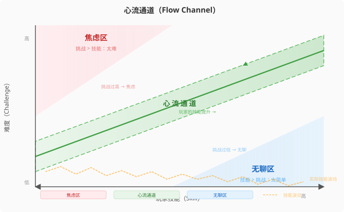

# 第15章：平衡与难度设计

> **本章定位：** 你的游戏机制跑通了、系统上线了、内容填满了。但玩家在第3关就开始碾压敌人——或者被第一个BOSS卡到删游戏。平衡与难度不是"最后调调数字"——它们是贯穿设计全过程的科学。本章提供从哲学到工具、从PvE到PvP的完整平衡方法论。
>
> **编程类比：** 平衡 ≈ 算法复杂度调优。你写了排序算法，它能跑——但输入100万元素时跑了10分钟。你不是重写算法，而是调参数（pivot选择、阈值切换）。平衡同理：不改机制，改数值和参数组合，让系统在"过于简单"和"过于复杂"之间找到最优区间。

---

## 15.1 平衡的科学哲学

**这一节解决什么问题：** "平衡"到底是什么意思？是不是所有东西都要一样强？本节建立平衡的正确定义，并解释它如何服务于游戏设计的最核心目标——有意义的选择。

### 平衡不是"相等"，而是"差异化有意义"

大多数新手听到"平衡不好"，第一反应是"那把弱的加强，强的削弱，调到差不多就行"。这是对平衡最危险的误解。

**平衡的正确定义：** 在一个平衡的游戏中，不存在一个在所有情境下都最优的选择；每个选项都有其成立的场景，也有其失效的时刻。

> **编程类比：** 平衡 ≈ 没有"银弹"设计模式。你不会在任何情况下都用Singleton——它有适用场景（全局状态），也有失效场景（多线程竞争）。好的设计模式选择 = 好的游戏策略选择：因时因地制宜。

这意味着：

| 不平衡的表现 | 本质问题 | 对玩家的伤害 |
|------------|---------|------------|
| 某武器/角色/策略在所有场景下都是最优解 | 有意义的选择被消灭——玩家不需要思考 | "这游戏只有一个玩法" |
| 某武器/角色/策略在任何场景下都毫无价值 | 设计空间被浪费——摆在那里是陷阱 | "选这个就是自虐，为什么还要做出来？" |
| 资源A溢出但资源B永远不够 | 资源系统有一条废腿 | "打到中期金币就是数字而已" |
| 某个风险行为的回报和低风险行为一样 | 风险-回报结构断裂 | "我为什么要冒险？" |

**平衡的本质：不是让选项相等，而是让差异化产生意义。** 一把高伤害但攻速慢的剑，和一把低伤害但攻速快的匕首，它们的"数字"不应该相等——它们的"使用场景"应该不同。平衡的工作不是消除差异，而是确保差异在正确的场景中成立。

### 平衡如何影响有意义的选择

回到本书第1章的核心概念——**有意义的选择 = 可辨识 + 可整合**。平衡直接决定了这两个条件：

**可辨识性：** 如果三个武器选项的实际效果几乎一样（因为过度平衡把它们磨平了），玩家无法辨识哪个更适合当前情境——所有选择看起来都一样。这就是"过度平衡"的危害：消灭了差异，也就消灭了趣味。

**可整合性：** 如果玩家选择了一个策略，但它在后续关卡中毫无发挥空间（因为设计从未给这个策略留"窗口期"），这个选择就无法整合到更大的游戏体验中。这就是"平衡不考虑情境"的危害。

> 《黑暗之魂》的力量型大锤和敏捷型双刀："平衡"不在于它们的DPS相等——实际上在不同BOSS战中它们的表现差异巨大。平衡在于：**两种流派都有属于自己的高光时刻**。用大锤的玩家在重甲BOSS战中感受到碾压的快感，用双刀的玩家在灵活BOSS战中体验到闪避反击的节奏之美。这就是"有意义的差异化"。

### 正反馈与负反馈：平衡的动态维度

静态数值平衡（武器A vs 武器B的DPS比较）只解决了一半问题。另一半在**动态平衡**——游戏进程中的优势如何演变。

来自 *Rules of Play* 的控制论框架：

```
正反馈循环：优势放大 → 优势方越来越强 → 加速结束
    例：Monopoly中买地多的玩家收更多租金 → 买更多地 → 赢更快

负反馈循环：优势抵消 → 落后方获得补偿 → 保持悬念
    例：Mario Kart中排名越靠后拿到的道具越强 → 追赶机会
```

| 反馈类型 | 效果 | 适合的场景 | 过度使用的危害 |
|---------|------|----------|-------------|
| **正反馈** | 加速游戏结束 | Roguelike的"爽局"、策略游戏的资源滚雪球 | 初期失误导致不可逆的败局 |
| **负反馈** | 保持竞争悬念 | 派对游戏、多人竞速、PvP对战 | 前期努力毫无意义——不如一直落后等补偿 |

**设计原则：** 正反馈让游戏有"方向"（走向结局），负反馈让游戏有"张力"（结局未定）。两者缺一不可。纯正反馈 = 一次失误全局崩盘。纯负反馈 = 永远分不出胜负。

---

## 15.2 平衡的工具和方法

**这一节解决什么问题：** "我知道该平衡什么了——但我怎么平衡？"本节提供四套可立即上手的工具，从数据架构到测试方法。

### 工具一：分层数据结构

如果你把每个敌人的每项数值直接硬编码在脚本里，当你要"所有敌人血量翻倍"时，你需要改300个文件。这是独立开发者最常见的数值噩梦。

正确的做法来自 *Practical Game Design* 的分层架构：

```
┌─────────────────────────────────────────────────┐
│                  第1层：全局变量                  │
│  base_hp = 100, damage_multiplier = 1.0          │
│  改动影响：整个游戏所有单位                        │
├─────────────────────────────────────────────────┤
│                  第2层：职业/类型                  │
│  战士 HP×1.5, 速度×0.8 | 法师 HP×0.7, 速度×1.0  │
│  改动影响：该职业下所有角色                        │
├─────────────────────────────────────────────────┤
│                  第3层：角色原型                  │
│  精英战士 ATK+20% | Boss法师 技能CD-30%          │
│  改动影响：该角色的所有变体                        │
├─────────────────────────────────────────────────┤
│                  第4层：个体变体                   │
│  Boss_炎魔_火抗 = 80 | Boss_炎魔_冰弱 = -50       │
│  改动影响：仅此个体                               │
└─────────────────────────────────────────────────┘
```

> **编程类比：** 分层数据结构 ≈ CSS 的层叠（Cascade）机制。Global是 `*` 选择器，Class是 `.class`，Archetype是 `#id`，Variant是 `!important`。越下层的规则优先级越高，覆盖上层的默认值。

**设置方法：**

1. **第1层**先设定好——选一个"标准单位"作为锚点。例如：标准战士 HP=100, ATK=10, SPD=5。
2. **第2层**在此基础上做百分比偏移——"法师是战士HP的70%"。永远用乘数而非绝对数。
3. **第3层**和第4层只在确实需要差异时才创建。每增加一层，你的测试组合数量就翻倍。

> 实践规则：**如果能用第1层解决问题，不要创建第2层。** 分层不是越多越好——它是管理复杂度的工具，不是炫技。

### 工具二：MBT（Main Battle Tank）基准法

从 *Practical Game Design* 引入的经典方法——选一个"标准单位"作为所有数值的参照系。

**操作步骤：**

| 步骤 | 操作 | 示例 |
|------|------|------|
| 1. 选基准单位 | 选一个"最普通、最标准"的单位 | 人类步兵（MBT） |
| 2. 设整数锚值 | 所有数值用容易计算的整数 | HP=100, DPS=10, SPD=10, COST=100 |
| 3. 计算效率值 | 每个属性 ÷ Cost = 效率比 | HP/Cost=1.0, DPS/Cost=0.1 |
| 4. 其他单位参照 | 新单位对比MBT，问"强多少/弱多少" | 精灵弓手：DPS/Cost=0.15（+50%效率），但HP/Cost=0.6（-40%） |
| 5. Excel验证 | 用TTK（Time To Kill）交叉验证 | TTK(步兵打弓手) vs TTK(弓手打步兵) |

**MBT方法的约束条件：** 适用于25-100个可比较单位、属性维度不超过5-8个的游戏。如果你的角色有30+独立属性，MBT会变得难以管理——此时需要迁移到分层数据结构的自动化计算。

### 工具三：电子表格模拟

在写任何一行代码之前，用Excel/Google Sheets模拟你的数值系统。这不是"额外工作"——这是**最便宜的设计迭代**。

**基础电子表格模拟模板：**

```
| 单位名  | HP | ATK | SPD | 技能倍率 | TTK(打战士) | TTK(打法师) | TTK(打Boss) |
|---------|----|-----|-----|---------|------------|------------|------------|
| 战士    | 100| 10  | 5   | 1.0     | 10.0s      | 14.3s      | 28.6s      |
| 法师    | 70 | 15  | 7   | 1.5     | 8.9s       | 6.2s       | 17.0s      |
| 弓手    | 60 | 12  | 9   | 1.2     | 11.1s      | 14.3s      | 25.0s      |
| Boss    | 200| 20  | 3   | 2.0     | 5.0s       | 3.5s       | 10.0s      |
```

**TTK计算公式：** `TTK(A打B) = B.HP / (A.ATK × A.技能倍率)` —— 这是"被秒率"的最简版本。实际上你还需要加入命中率、暴击率、护甲减伤等维度。每加一个维度，TTK公式就复杂一层——**在加入新维度之前，先检查：这个维度能否产生有意义的策略差异？如果只是让数字看起来更"精致"，那就不值得。**

> *Practical Game Design* 的经验：**Unified Units (UU)**——将一切换算为统一单位。例如：1点伤害 = 1 UU，1%暴击率 = 0.5 UU（因为暴击的额外伤害期望），1秒冷却缩减 = 1.5 UU。所有属性换算为UU后，你可以在同一张表格里比较"苹果"和"橘子"。

**电子表格的三个关键公式：**
- `TTK(单位A, 单位B)` — 检验单位A打单位B需要多长时间
- `Efficiency(属性, Cost)` — 检验每单位成本买到多少属性
- `WinRate(单位A, 单位B)` — 在简化的战斗模拟中，A对B的胜率

如果TTK的分布出现"某单位打所有人TTK都最低"——这就是需要削弱的信号。如果WinRate出现"某单位对阵所有人的胜率都>70%"——这是一个设计师层面的问题，不是数值层面的问题：这个单位的设计概念本身可能破坏了系统的平衡结构。

### 工具四：砍半/翻倍测试法

来自 *Video Game Design For Dummies* 的实战技巧——当你不确定哪个方向调时，先做极端测试。

**操作规则：** 当你怀疑某个数值有问题时，把它的值砍半或翻倍，然后玩一局。极端数值会让隐藏的问题立刻暴露——游戏变得无聊（数值太强）或无法进行（数值太弱），你一定能在5分钟内感觉到。

| 这一步 | 实际操作 |
|--------|---------|
| 1. 选一个可疑的数值 | 敌人攻击力？技能冷却？经验曲线？ |
| 2. 砍半 | 把值设为原来的 50%，玩一局 |
| 3. 翻倍 | 把值设为原来的 200%，玩一局 |
| 4. 观察极端反应 | 哪个极端让游戏"更快崩"？哪个极端反而没那么糟？ |
| 5. 二分逼近 | 在极端之间二分搜索：50% → 75% → 87.5%……直到满意 |

**为什么这比微调更有效：** 从100调到105，你可能感觉不到任何差异——你浪费了30分钟。从100调到50，你在3分钟内就知道"太弱了，弱的程度大概是x"。两次极端测试界定了一个范围，之后你在范围内二分搜索。这是数值调试的"二分查找"。

---

## 15.3 难度的多维设计

**这一节解决什么问题：** "调高敌人血量"是新手对难度设计的全部理解。本节拆解难度的五个独立维度，并提供心流理论指导下的难度曲线设计方法。

### 维度一：不是只调HP——难度是多维的

如果把难度简化为"把敌人的HP和伤害乘以1.5"，你会得到一个更磨人但不更难的游戏——玩家做同样的事，只是多花50%的时间。这不是难，这是**冗**。

真正有意义的难度存在于以下五个独立维度：

| 维度 | 简单模式 | 困难模式 | 独立游戏的实现建议 |
|------|---------|---------|-----------------|
| **数值压力** | 敌人HP/伤害 = 1.0× | 敌人HP/伤害 = 1.5-2.0× | 最少使用——冗余度最高 |
| **AI行为复杂度** | 敌人只用2种攻击模式 | 敌人用5种攻击模式 + 协同 | 多投入设计，少投入数值 |
| **资源紧缩** | 药水/弹药充足 | 药水/弹药严格限量 | PvE中非常有效 |
| **信息削减** | 小地图显示敌人位置 | 无小地图，仅靠视觉/听觉判断 | 恐怖/潜入类游戏的核心难度维度 |
| **惩罚加重** | 死后回到检查点 | 死后失去资源/进度（Roguelike） | 永久死亡的心理学需要配套设计 |

> **《黑暗之魂》的难度设计：** 如果只看数值，《黑暗之魂》的敌人HP和伤害并不比同类ARPG高多少。它的难度核心在于四个维度的叠加——**(1) 每次攻击后体力耗尽，无法无限连击（资源紧缩）；(2) 每次死亡后从篝火重新跑回，沿途敌人全部复活（惩罚加重）；(3) 敌人攻击模式需要观察学习而非硬扛（AI行为复杂度）；(4) 没有小地图和任务标记（信息削减）。** 这就是为什么《黑暗之魂》的难度让人感到"公平"——它不是靠数值碾压你，而是靠规则约束你。

### 维度二：AI行为的难度分层

AI的难度不应该是一个"聪明度滑块"从0拖到100。它应该是一组可独立控制的**行为开关**：

| 难度层级 | AI行为描述 | 示例（射击游戏敌人） |
|---------|----------|-------------------|
| 1级 | 站在原地射击 | 炮塔式敌人 |
| 2级 | 射击后随机移动 | 基础步兵 |
| 3级 | 移动到掩体后射击 | 训练有素的士兵 |
| 4级 | 利用掩体 + 切换射击位置 + 短暂火力压制 | 精英敌人 |
| 5级 | 包抄玩家 + 队友火力掩护 + 使用投掷物逼出掩体 | 战术小队 |

**实现建议：** 不要为"简单""普通""困难"各写一套AI。而是将上述行为层级做成**可组合的模块**：简单模式启用1-2级行为，普通模式3-4级，困难模式5级外加更高的反应速度参数。

> 独立游戏的现实约束：你不可能开发《FEAR》级别的AI。你的AI有5-6个可切换的行为模块，加上1-2个概率参数（"使用投掷物的概率"），就已经足够创造明显的难度层次感。

### 维度三：关卡复杂度递进

难度不能只装在敌人身上——关卡本身的结构就是难度的一部分。

| 关卡维度 | 简单 | 中等 | 困难 |
|---------|------|------|------|
| 空间复杂度 | 单一走廊 | 多路径但汇聚 | 垂直分层 + 多入口 |
| 敌人编排 | 一次只有1种敌人 | 2种敌人同时出现 | 3种敌人 + 环境威胁 |
| 时间压力 | 无 | 有限时目标 | 不断逼近的威胁 |
| 决策密度 | 每次只面对1个选择 | 2-3个并发选择 | 同时管理攻击、防御、资源、位置 |

### 维度四：心流理论在难度设计中的应用

心流（Flow）是Csikszentmihalyi提出的核心概念——当挑战与技能精确匹配时，人会进入一种"全神贯注、时间消失、行动与意识融合"的最优体验状态。对游戏设计师而言，心流就是玩家觉得"刚刚好"的那个点。

**心流通道图：**



**心流通道的设计法则：**

1. **锯齿形难度曲线，而非直线上升。** 玩家的技能不是线性增长的——它在"练习→掌握→运用→疲劳"的循环中波动。难度应该跟随这个节奏：上升一段 → 给你一个相对容易的段落喘息 → 再上升。

2. **在引入新机制后降低外围难度。** 当玩家第一次拿到二段跳时，接下来的平台不应该同时又窄又远。让玩家先用二段跳"爽一把"，再逐步加难度。这是"学习窗口"——新能力在一个低风险环境中被熟练掌握后，才能在高压环境中被调用。

3. **难度峰值必须匹配情绪高潮。** 一场BOSS战应该是该章节的难度最高点——不是因为"BOSS是最终敌人所以该最难"，而是因为难度是最有效的情绪放大器。如果你把难度峰值放在普通的杂兵遭遇战中，玩家会感到挫败而非兴奋。

> **《黑暗之魂》的心流管理：** 每个区域的结构是——安全区（篝火）→ 探索（中等难度，学习敌人模式）→ 捷径解锁（奖励）→ BOSS战（难度峰值，考验综合掌握）→ 战胜后获得喘息和新区域。这个"紧张-释放-紧张"的锯齿结构，就是心流通道在关卡设计中的具体落地。

### 难度设计的常见错误

| 错误 | 后果 | 修正方法 |
|------|------|---------|
| **难度均匀递增** | 没有节奏，玩家疲劳 | 改为锯齿形——每段上升后有一个"容易段" |
| **新机制 + 高难度同时出现** | 玩家同时处理"学习"和"生存" | 引入新机制的段落降低环境威胁 |
| **只在一个维度上加难度** | "打到后期就是同样的敌人血更厚" | 按五个维度轮换增强——这关加AI行为，下关缩资源 |
| **用随机性替代难度设计** | 玩家感到"这不是我的错" | 随机数可以改变参数，但不能替代有意图的关卡编排 |

---

## 15.4 PvP平衡的独特挑战

**这一节解决什么问题：** PvE的平衡你可以靠数据和反复测试慢慢调——但PvP中，你的对手是和你一样聪明的玩家。本节专注于PvP特有的平衡哲学和博弈论工具。

### 对称平衡 vs 非对称平衡

PvP平衡分为两大类，它们的难度不是一个数量级的：

| | 对称平衡 | 非对称平衡 |
|---|---------|----------|
| **定义** | 所有玩家用相同的角色/资源 | 不同玩家有不同角色/能力 |
| **例子** | 围棋/国际象棋、《CS:GO》竞技模式 | 《英雄联盟》《皇室战争》《守望先锋》 |
| **平衡难度** | 低——检查规则是否对先手/后手公平即可 | 极高——N个角色 = N×(N-1)/2 个对抗关系 |
| **核心挑战** | 地图对称性、先手优势补偿 | 每个角色都需要"有出场机会 + 有可被针对的弱点" |

> **《皇室战争》的平衡哲学：** Supercell面临的挑战是——100+张卡牌，每张的出场率和胜率都要被监控。他们的策略不是追求"所有卡牌胜率50%"，而是——**(1) 每张卡有明确的"克制链条"（A克制B、B克制C、C克制A），形成自平衡循环；(2) 当某张卡的出场率超过一定阈值时，不是直接削数值，而是引入新的克制卡或加强其被克制方；(3) 通过赛季机制周期性"换meta"——让不同类型卡牌轮流成为版本焦点。** 这三点合在一起，构成了非对称PvP平衡的三条核心策略。

### 博弈论在多人平衡中的应用

从 *Rules of Play* 引入的博弈论框架，对PvP平衡有直接指导意义：

**1. 占优策略（Dominant Strategy）是平衡的头号敌人。** 如果存在一种策略，无论对手做什么它都是最优选择，那游戏就只有一个玩法。平衡的首要任务是消灭占优策略——确保针对每种策略，至少存在一种有效的反制策略。

**2. 纳什均衡告诉我们——平衡的目标不是"所有人选不同策略"，而是"在知道别人选什么之后，你不会后悔自己的选择"。** 这在实际设计中意味着：不要强迫玩家分散选择，而是让"分散选择"成为自然涌现的结果。如果有30%的玩家选策略A、30%选策略B、40%选策略C，且没有人觉得"我应该换"——这就是一个健康的状态。

**3. 混合策略（Mixed Strategy）是设计空间，不是数学作业。** 博弈论中的"混合策略"指以一定概率在不同纯策略间切换。在游戏中，这对应着"玩家需要根据战况灵活变换策略"。好的PvP设计确保没有一种固定策略可以应对所有情况——强迫玩家在游戏过程中不断做"读对手+选反制"的决策循环。

**4. 信息结构决定博弈类型。** 不完全信息博弈（如《星际争霸》的战争迷雾、卡牌游戏的手牌隐藏）和完全信息博弈（如国际象棋）的平衡策略完全不同。如果你做的是不完全信息游戏，平衡的度量不是"双方知道一切后的最优解"，而是"在有限信息下，做出合理推测后的胜率分布"。

### 多人平衡的实操规则

| 规则 | 说明 | 反例 |
|------|------|------|
| **先做石头剪刀布，再细化数值** | 确保每个选项存在明确的被克制方 | 某角色被所有其他角色压制 |
| **不要同时改多个东西** | 一次只调一个维度，观察一周数据 | "我们把伤害削弱一点，再增加冷却时间"——分两次做 |
| **Nerf by contrast（间接削弱）** | 与其直接削弱强的，不如加强其克星 | "把A的伤害从100降到80" vs "把克制A的B的功能加强" |
| **强≠出场率高≠该削** | 出场率高可能是因为"有趣"而非"强" | 华丽的角色天然出场率高 |
| **胜率在45%-55%之间都是健康的** | 追求精确的50%胜率是过度平衡 | 5%的波动在统计上是正常的 |

> *Supercell的经验：* 在《皇室战争》中，一张卡牌使用率超过20%就开始关注，超过30%就标记为"需要调整"。但调整方式首选"引入反制"而非"直接削弱"——因为玩家讨厌自己练了很久的东西突然变弱。

---

## 实操清单

每次做平衡和难度调整时，用此清单逐项检查：

- [ ] **平衡哲学检查：** 我的改动是让差异化更有意义，还是在磨平差异？玩家有没有"在不同情境下选择不同策略"的理由？
- [ ] **正负反馈检查：** 我的游戏中有正反馈（帮助结束游戏）和负反馈（保持悬念）两种回路吗？优势方会不会永远赢？落后方有没有追赶的机会？
- [ ] **分层数据检查：** 数值是否按 Globals → Classes → Archetypes → Variants 分层管理？如果要全局调整一个参数，我能在5分钟内完成还是需要改100个文件？
- [ ] **MBT基准检查：** 有没有一个"标准单位"作为所有数值的锚点？新加的每个单位是否和MBT做过TTK对比？
- [ ] **电子表格检查：** 核心数值是否在Excel里跑过基础模拟？TTK分布和WinRate分布是否在可接受范围内？
- [ ] **砍半/翻倍测试：** 最近一次调整数值时，是否先用极端值测试了敏感度，还是直接做了微调？
- [ ] **难度多维检查：** 当前关卡的难度是从哪几个维度施加的？是不是只在堆HP？是否有一个维度可以替代数值缩放？
- [ ] **心流通道检查：** 难度曲线是锯齿形的还是直线上升的？引入新机制后的段落是否降低了外围威胁？情绪高潮是否匹配难度峰值？
- [ ] **PvP平衡检查（如适用）：** 是否存在占优策略？每个角色/策略是否有明确的克星？最近一次平衡调整是否只动了一个维度？

---

## 失败信号

以下信号出现时，说明你的平衡或难度设计可能需要从底层重新审视：

| 信号 | 诊断 | 不是这个原因的排除条件 |
|------|------|---------------------|
| 玩家在某关卡集体流失（流失率陡升） | 难度出现尖刺——该关需要的技能前序关卡没教 | 先确认不是Crash或加载Bug导致的流失 |
| 所有玩家使用同一套Build/策略 | 存在占优策略——其他选项的有效性没有成立 | 先确认其他选项是否"根本没被发现"而非"被评估后放弃" |
| 游戏前30%的内容后玩家感到无聊 | 难度增长跟不上玩家技能增长——进入无聊区 | 先确认是否是内容重复（非难度问题而是内容问题） |
| 某资源在中期开始溢出且无出口 | 资源系统有一条废腿——该资源的消耗设计失效 | 先确认是否所有玩家都溢出，还是只有"认真玩法"溢出 |
| PvP中某角色/卡牌使用率>40% | 该选项明显过强或被感知为过强 | 先区分"强"和"有趣"——高使用率可能是因为好玩 |
| 连续5轮平衡调整后胜率仍不收敛 | 问题不在数值而在机制——该设计的底层结构有问题 | 此时不应继续调参，应回到设计层面 |

---

## 骨架-血肉-灵魂自查

| 层 | 自查问题 | 通过标准 |
|----|---------|---------|
| **骨架（机制与规则）** | 所有选项的价值是否在不同情境下各有成立？是否存在占优策略？ | 没有一种策略在所有情境下都是最优解 |
| **骨架（机制与规则）** | 正负反馈是否都存在于系统中？ | 领先方不会永远赢，落后方不会永远追不上 |
| **骨架（机制与规则）** | 数值是否按 Globals→Classes→Archetypes→Variants 分层管理？ | 全局调一个参数 ≤ 5 分钟完成 |
| **血肉（表现与动态）** | 难度信号是否清晰——玩家能否感知到"这个敌人比之前更强了"以及"强在哪里"？ | 测试者能说出"这个敌人和之前的不一样，因为……" |
| **血肉（表现与动态）** | 被击败时，玩家是觉得"我的操作有问题"还是"这判定不讲道理"？ | 至少 70% 的死亡反馈被测试者归因于"我自己的问题" |
| **血肉（表现与动态）** | 平衡改动是否让玩家感知到——还是后台数值变了但体验毫无区别？ | 关键数值调整后，测试者的策略选择出现可观测的变化 |
| **灵魂（情感与意义）** | 玩家在战胜困难后是否有成就感（fiero）？ | 测试者通关后自发微笑、握拳、或说"YES!" |
| **灵魂（情感与意义）** | 失败时是否觉得"有趣，再试一次"而非"这游戏就是在刁难我"？ | 死亡后 3 秒内点击重试的比例 ≥ 80% |
| **灵魂（情感与意义）** | 平衡是否在帮助玩家"表达自己的风格"——不同玩家能否用不同的 Build 通关？ | 两个不同 playstyle 的测试者都能通关，但选择了完全不同的策略 |

